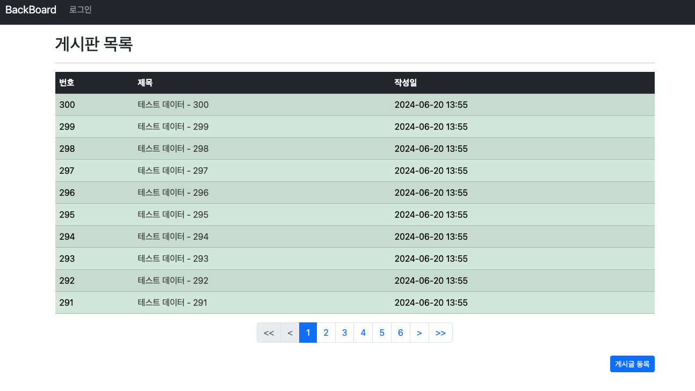

## Springboot 7일차
> 1. Spring Data Jpa - 쿼리 메서드
> 2. 페이징 기능
> 3. 댓글 갯수 표시
> 4. 스프링 시큐리티 세팅
> 5. 회원가입 기능 전 엔티티 세팅
---
### 1. Spring Data Jpa - 쿼리 메서드
- 페이징 기능을 만들기에 앞서 JPA 의 쿼리메서드 기능을 이용하여 메서드명으로만으로 쿼리를 자동으로 생성해준다.
    ```java
    public interface BoardRepository extends JpaRepository<Board, Long> {
        // 쿼리 메서드
        Optional<Board> findByBno(Long bno);
        Optional<Board> findByTitle(String title);
        List<Board> findByTitleLike(String title);
    }
    ```
    > [JPA 공식문서(쿼리메서드)](https://docs.spring.io/spring-data/jpa/reference/jpa/query-methods.html)를 참고하면 더 많은 쿼리메서드를 사용할 수 있다.
---
### 2. 페이징 기능
- `Spring Data JPA` 가 제공하는 페이징 기능을 쓰기 위해 `Page` 와 `Pageable` 객체를 사용한다.
  ```java
  import org.springframework.data.domain.Page;
  import org.springframework.data.domain.Pageable;
  
  public interface BoardRepository extends JpaRepository<Board, Long> {
      Page<Board> findAll(Pageable pageable);
  }
  ```
- 쿼리메서드 기능을 사용하지 않고 `@Query` 어노테이션을 통해 원하는 메서드 명에 쿼리를 직접 적어줄 수 있다.(Oracle 기준)
  ```sql
  SELECT BNO, TITLE, CONTENT, CREATE_DATE FROM BOARD OFFSET 0 ROWS FETCH FIRST 10 ROWS ONLY;
  ```
- `BoardService` 와 `BoardController` 클래스에서는 아래와 같이 수정하면 된다.
  ```java
  // BoardService
  public Page<Board> boardList(int page) {
    return boardRepository.findAll(PageRequest.of(page, 10));
  }
  
  // BoardController
  @GetMapping("/list")
  public String boardFormV2(Model model, @RequestParam(value = "page", defaultValue = "0") int page) {
      model.addAttribute("paging", boardService.boardList(page));
      return "board/list";
  }
  ```
  
- 이제는 하단에 페이지 이동을 할 수 있는 번호들을 만들고 각 번호를 클릭 할 때마다 `page` 값을 다르게 넘겨주면 된다.
- 인덱스는 0부터 시작하지만 1부터 시작하게하고 가장 처음과 가장 끝에가면 이전과 다음 버튼을 비활성화 시킨다.
- 그리고 제일앞, 제일 뒤로 가는 버튼도 추가하였다.
  ```html
  <nav th:if="${!paging.isEmpty()}" aria-label="Page navigation example">
    <ul class="pagination justify-content-center">
      <li th:classappend="${!paging.hasPrevious()} ? disabled" class="page-item">
        <a th:href="@{|?page=0|}" class="page-link">&lt;&lt;</a>
      </li>
      <li th:classappend="${!paging.hasPrevious()} ? disabled" class="page-item">
        <a th:href="@{|?page=${paging.number-1}|}" class="page-link">&lt;</a>
      </li>
      <li th:each="page : ${#numbers.sequence(0, (paging.totalPages)-1)}"
          th:if="${page >= (paging.number)-5 and page <= (paging.number)+5}"
          th:classappend="${page == paging.number} ? active"
          class="page-item">
        <a th:href="@{|?page=${page}|}" th:text="${page}+1" class="page-link"></a>
      </li>
      <li th:classappend="${!paging.hasNext()} ? disabled" class="page-item">
        <a th:href="@{|?page=${paging.number+1}|}" class="page-link">&gt;</a>
      </li>
      <li th:classappend="${!paging.hasNext()} ? disabled" class="page-item">
        <a th:href="@{|?page=${(paging.getTotalPages())-1}|}" class="page-link">&gt;&gt;</a>
      </li>
    </ul>
  </nav>
  ```
  
  
- 현재 데이터는 잘 갖고오지만 제대로 정렬이 안되어있다.
  ```java
  public Page<Board> boardList(int page) {
      List<Sort.Order> sorts = new ArrayList<>();
      sorts.add(Sort.Order.desc("createDate"));
      return boardRepository.findAll(PageRequest.of(page, 10, Sort.by(sorts)));
  }
  ```
  
- 각 페이지에 맞는 번호가 필요하기 때문에 번호를 나타내는 부분에 계산식이 필요
  ```html
  <td th:text="${paging.getTotalElements()-(paging.number * paging.size)-loop.index}"></td>
  ```
  
---
### 3. 댓글 갯수 표시
- `Bootstrap`을 이용하여 게시글 목록에 댓글갯수를 표시
  ```html
  <td th:text="${paging.getTotalElements()-(paging.number * paging.size)-loop.index}"></td>
  ```
  
---
### 4. 스프링 시큐리티 세팅
- `build.gradle` 에서 `SpringSecurity` 의존성을 추가한 뒤 프로젝트를 실행하면 **시큐리티가 제공하는 로그인창으로 이동**한다.
  - ID : `user`
  - PW : 콘솔 창에 뜨는 랜덤 문자열
- `config/SecurityConfig.java` 를 생성하여 스프링 시큐리티 기본 설정들을 작업한다.
  ```java
  @Configuration
  @EnableWebSecurity
  public class SecurityConfig {
  
      @Bean
      public SecurityFilterChain securityFilterChain(HttpSecurity http) throws Exception {
          http.
              // localhost:8080/ 로 시작하는 모든 경로 허용
              authorizeHttpRequests(auth -> auth.requestMatchers("/**").permitAll()).
              // CSRF 위변조 공격을 막는 부분해제, 특정 URL은 CSRF 공격 리스트에서 제거
              csrf(csrt -> csrt.ignoringRequestMatchers("/h2-console/**")).
              // h2-console 페이지가 <frameset> , <frame>으로 구성되기 때문에 CORS와 유사한 옵션 추가
              headers(headerConfig -> headerConfig.addHeaderWriter(
                      new XFrameOptionsHeaderWriter(XFrameOptionsHeaderWriter.XFrameOptionsMode.SAMEORIGIN)))
          ;
  
          return http.build();
      }
  }
  ```
- DB 변경 : `H2` -> `Oracle`
---
### 5. 회원가입 기능 전 엔티티 세팅
- `Member` 엔티티
  ```java
  @Builder
  @Getter
  @Setter
  @NoArgsConstructor @AllArgsConstructor
  @Entity
  public class Member {
    @Id
    @GeneratedValue(strategy = GenerationType.SEQUENCE)
    private Long mid;

    @Column(unique = true, length = 100)
    private String username;

    @Column(unique = true, length = 150)
    private String email;

    private String password;

    @CreatedDate
    @Column(updatable = false)
    private LocalDateTime createDate;
  }
  ```
- `MemberRepository` 인터페이스
  ```java
  public interface MemberRepository extends JpaRepository<Member, Long> {
  }
  ```
- `MemberService` 클래스에서는 회원가입을 담당하는 메서드를 구현하고 비밀번호 암호화 코드까지 추가해준다.
  ```java
  @Transactional(readOnly = true)
  @RequiredArgsConstructor
  @Service
  public class MemberService {
    private final MemberRepository memberRepository;
  
    @Transactional
    public Member saveMember(String username, String email, String password) {
      BCryptPasswordEncoder bCryptPasswordEncoder = new BCryptPasswordEncoder();
  
      Member savedMember = memberRepository.save(
              Member.builder().
                      username(username).
                      email(email).
                      password(bCryptPasswordEncoder.encode(password)).
                      createDate(LocalDateTime.now()).build());
  
      return savedMember;
    }
  }
  ```
---