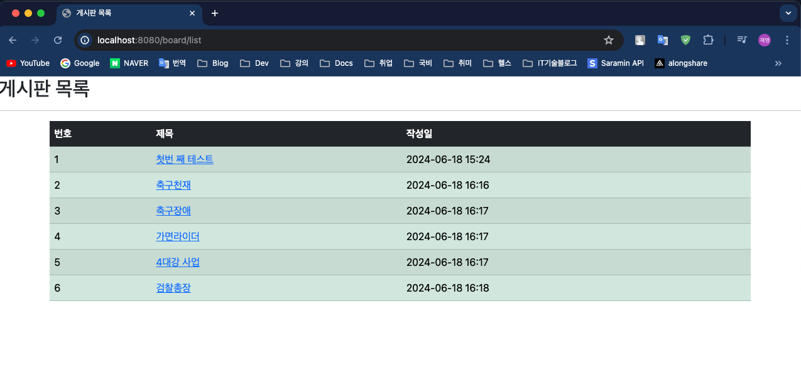
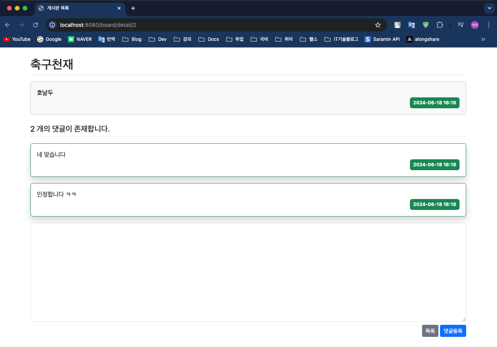

## Springboot 5일차
> 1. Junit5 로 테스트 코드 구현
> 2. Thymeleaf + JPA 로 SSR(Server Side Rendring) 구현
> 3. `Bootstrap` 스타일 적용

---
### 1. Junit5 로 테스트 코드 구현
- `Junit5` 테스트코드 `Update` , `Select` , `Delete` 구현
---
### 2. Thymeleaf + JPA 로 SSR(Server Side Rendring) 구현
- `BoardService` 클래스 생성후 `boardList()` 메서드 작성
- `BoardController` 클래스 생성 후 `@GetMapping` 으로 URL 설정 -> `/board/list`
- `list.html`  생성 후 컨트롤러에서 전달한 객체를 View 에 랜더링
  - `<html>` 태그 안에 `xmlns:th="http://www.thymeleaf.org"` 를 넣어줘야 한다.
  - 타임리프 문법을 통해 모든 데이터 테이블에 추가
  - 각 데이터의 타이틀을 누르면 상세페이지로 이동
- `BoardService` 클래스에 findBoard() 메서드 작성
- `BoardController` 클래스에 @GetMapping 으로 URL 설정 -> `/board/detail/{bno}`
- `detail.html` 생성 후 컨트롤러에서 전달한 객체를 View 에 랜더링
- `detail.html` 에 댓글 기능 추가
  - `<form>` 태그로 댓글 입력부분 생성
  - `ReplyService` 클래스 생성하여 댓글 저장 메서드 작성
  - `ReplyController` 클래스 생성하고 Html Form 전송 데이터를 받기. -> `/reply/create/{bno}`
---
### 3. `Bootstrap` 스타일 적용
1. Bootstrap 파일 다운로드 후 프로젝트 내부에 저장 -> `boostrap.min.css`, `bootstrap.min.js` 을 `/resources/static/css or js` 에 저장
2. CDN 으로 링크로 추가

#### 결과화면
- `/board/list`

  
- `board/detail/{bno}`

  
  