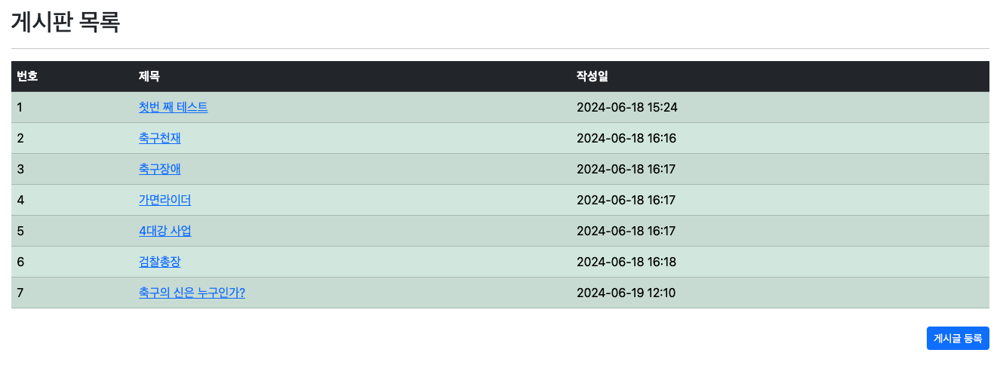
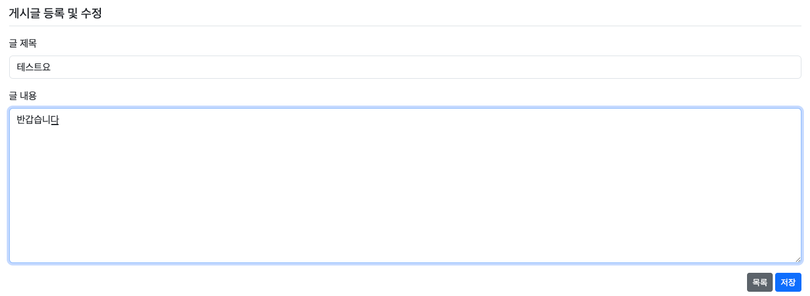
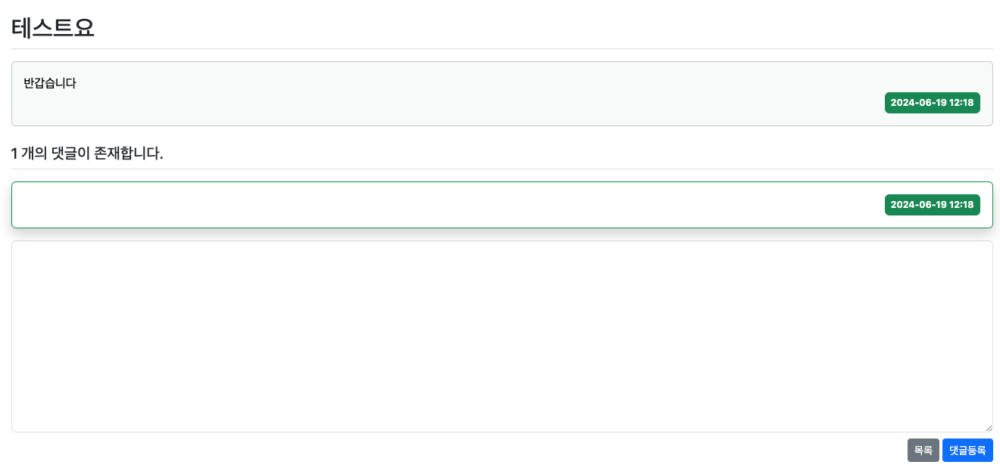
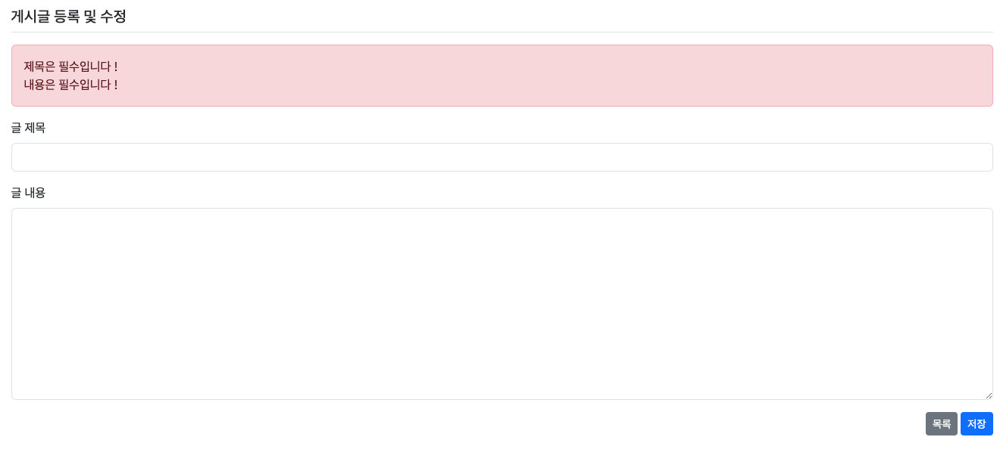
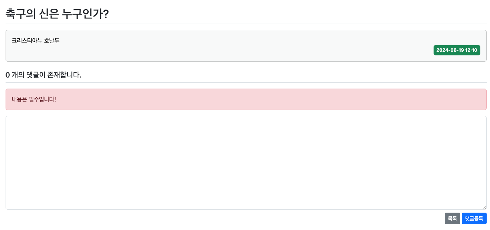
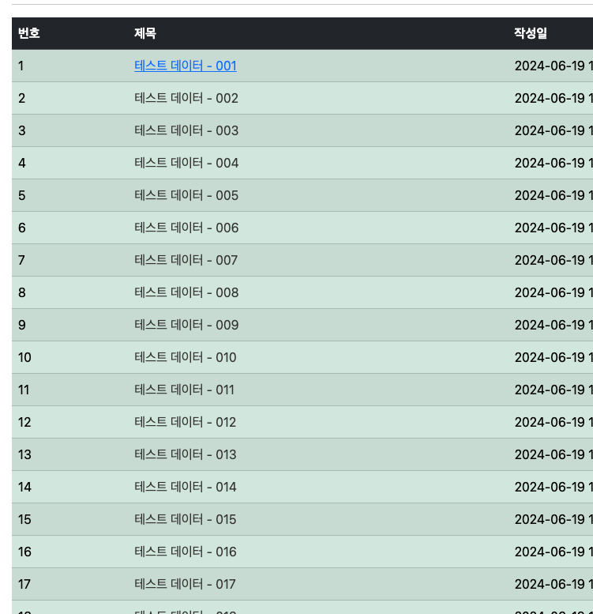

## Springboot 6일차
> 1. Thymeleaf 레이아웃 템플릿 생성 및 적용
> 2. 유효성 검사 - Validation
> 3. 네비게이션바(Bootstrap) 추가
> 4. 호버(hover) 기능 추가
---
### 1. Thymeleaf 레이아웃 템플릿 생성 및 적용
- `/temlates/layout.html` 으로 레이아웃 생성
- `build.gradle` 에 타임리프 레이아웃을 위한 의존성 추가
  - `implementation 'nz.net.ultraq.thymeleaf:thymeleaf-layout-dialect'`
- `Bootstrap` 방식을 다운로드 파일이 아닌 `CDN`으로 변경
  - `layout.html` 에 기존 다운로드파일 경로를 주석하고 `CDN` 링크를 추가한다 
- `/board/create.html` 생성하여 게시글 작성 Form 생성
- `/board/list.html` 에 게시글 등록 버튼 추가
  
  
- `BoardController.java` 클래스에 게시물생성 폼 연결 - `@GetMapping`
  
  
- `BoardController.java` 클래스에 게시물생성 로직 추가 - `@PostMapping`
- 데이터 입력 후 댓글등록 클릭 시 상세페이지로 이동
  
  
---
### 2. 유효성 검사 - Validation
- 현재 클라이언트에서 요청한 데이터를 Null 값도 그냥 받기 때문에 유효성 검사가 필요함 !
  - `build.gradle` 에 유효성 검사를 위한 의존성 추가 -> `Validation`
  - `/validation/BoardForm.java` 클래스를 생성하여 유효성 검사를 함.
    ```java
    @Getter
    @Setter
    public class BoardForm {
    
        @Size(max = 250)
        @NotBlank(message = "제목은 필수입니다 !")
        private String title;
    
        @NotBlank(message = "내용은 필수입니다 !")
        private String content;
    }
    ```
- 유효성검사 실패 시 에러를 담을 객체를 `BoardController` 에 생성
  ```java
  @PostMapping("/create")
  public String create(@Valid BoardForm form, BindingResult bindingResult) {
      if(bindingResult.hasErrors())
          return "/board/create";
  
      Long bno = boardService.saveBoard(form.getTitle(), form.getContent());
  
      return "redirect:/board/detail/" + bno;
  }
  ```
- `create.html` 파일에서 타임리프 문법을 통해 유효성검사 실패 시 메시지를 띄우는 작업이 필요!
  ```thymeleafexpressions
  <form th:actio="@{/board/create}" th:object="${boardForm}" method="post">
      <div class="alert alert-danger" role="alert" th:if="${#fields.hasAnyErrors()}">
        <div th:each="error : ${#fields.allErrors()}" th:text="${error}"></div>
      </div>
  </form>
  .... 생략
  ```
  
  > 클라이언트(브라우저)에서 데이터 요청을 받을 때는 컨트롤러에서 `Validation` 을 이용하여 유효성 검사가 꼭 필요하다 !
- 현재 title 과 content 둘 중 하나만 입력하고 제출 시 빈 데이터를 입력하라고 알림창이 뜬다. 하지만 모든 필드값이 초기화 되기 때문에 `<input>` 태그 수정이 필요
  ```html
  <div class="mb-3">
        <label for="title" class="form-label">글 제목</label>
        <input type="text" th:field="*{title}" class="form-control">
      </div>
    
      <div class="mb-3">
        <label for="content" class="form-label">글 내용</label>
        <textarea th:field="*{content}" class="form-control" rows="10"></textarea>
      </div>
  ```
- 댓글창도 유효성 검사가 필요하다 
  - 댓글 유효성 검사를 위한 객체를 생성한다 -> `ReplyForm.java`
    ```java
    @Getter
    @Setter
    public class ReplyForm {
        @NotEmpty(message = "내용은 필수입니다!")
        private String content;
    }
    ```
  - 컨트롤러에서는 유효성검사를 위한 `@Valid` 어노테이션과 에러를 담은 `BindingResult` 객체를 받는다.
    ```java
    @PostMapping("/create/{bno}")
    public String createReply(@Valid ReplyForm form, BindingResult bindingResult, @PathVariable("bno") Long bno, Model model) {
        Board board = boardService.findBoard(bno);
        if (bindingResult.hasErrors()) {
            model.addAttribute("board", board);
            return "board/detail";
        }
        replyService.replySave(board, form.getContent());
        log.info("Reply save success");
        model.addAttribute("board", board);
        return String.format("redirect:/board/detail/%s", bno);
    }
    ```
    
- 현재 유효성 검사 실패 시 알림창을 띄우는 HTML 코드를 타임리프 레이아웃으로 블럭화 시킨다.
  ```html
  <div class="alert alert-danger" role="alert" th:if="${#fields.hasAnyErrors()}">
    <div th:each="error : ${#fields.allErrors()}" th:text="${error}"></div>
  </div>
  ```
- `errors.html` 을 만들어 아래와 같이 구현한다.
  ```html
  <div th:fragment="formErrorFragment" class="alert alert-danger" role="alert" th:if="${#fields.hasAnyErrors()}">
    <div th:each="error : ${#fields.allErrors()}" th:text="${error}"></div>
  </div>
  ```
- 기존 유효성 검사 실패 알림창이 띄우는 태그를 아래와 같이 수정해준다.
  ```html
  <div th:replace="~{errors :: formErrorFragment}"></div>
  ```
---
### 3. 네비게이션바(Bootstrap) 추가
- `Bootstrap` 을 이용한 **네비게이션바(navbar)** 추가
- `layout.html` 코드에서 `<body>` 바로 아래에 코드를 추가
  ```html
  <!-- 네비게이션 바 -->
  <nav class="navbar navbar-expand-lg navbar-dark bg-dark border-bottom">
    <div class="container-fluid">
      <a class="navbar-brand" href="/board/list">BackBoard</a>
      <!-- 햄버거 버튼 toggle -->
      <button class="navbar-toggler" type="button" data-bs-toggle="collapse" data-bs-target="#navbarSupportedContent"
              aria-controls="navbarSupportedContent" aria-expanded="false" aria-label="Toggle navigation">
        <span class="navbar-toggler-icon"></span>
      </button>
      <div class="collapse navbar-collapse" id="navbarSupportedContent">
        <ul class="navbar-nav me-auto mb-2 mb-lg-0">
          <li class="nav-item">
            <a class="nav-link" href="#">로그인</a>
          </li>
        </ul>
      </div>
    </div>
  </nav>
  ```
---
### 4. 호버추가
- `main.css` 를 생성하여 마우스 올릴 때 효과를 수정
  ```css
  /* 밑줄 제거 및 색깔 변경*/
  a {
      text-decoration: none;
      color: #333333;
  }
  
  /* 마우스 올리면 밑줄 생기게 */
  a:hover{
      text-decoration: underline;
      color: #0d6efd;
  }
  ```
  