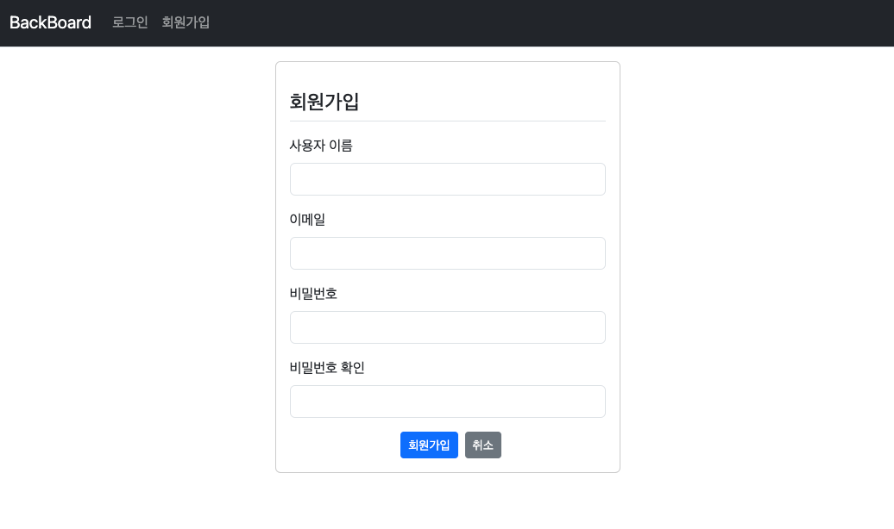
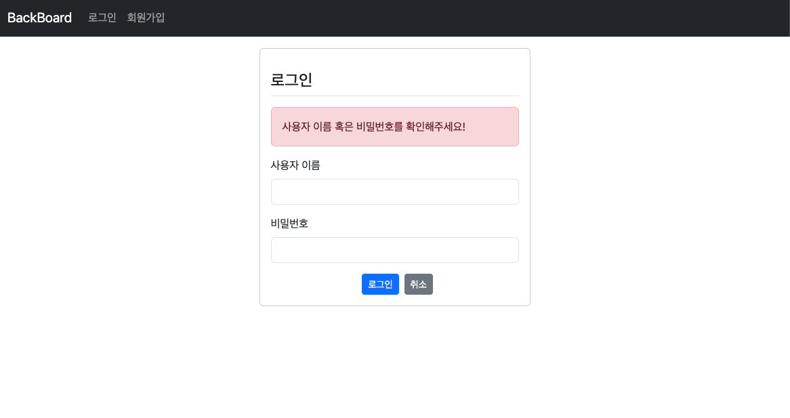
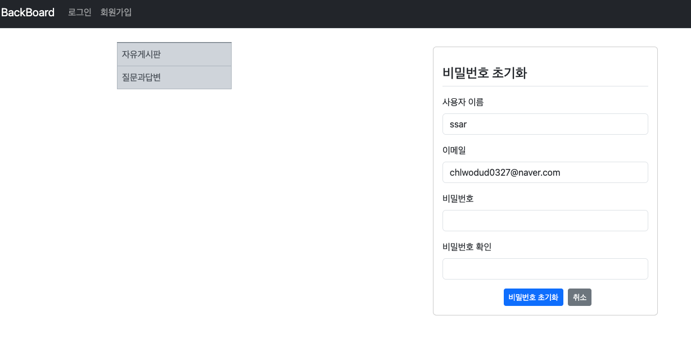

## Springboot 8일차
> 1. SpringSecurity 회원가입 구현
> 2. SpringSecurity 로그인 구현
> 3. SpringSecurity 로그아웃 구현
> 4. 게시글 작성자,댓글 작성자 추가
---
## 1. SpringSecurity 회원가입 구현
### 암호화 클래스 Bean 등록
- 비밀번호 암호화를 위한 `BCryptPasswordEncoder` 클래스를 Spring Bean 등록
- `SecurityConfig` 클래스에 `Bean` 등록을 해준다.
    ```java
    @Configuration
    @EnableWebSecurity
    public class SecurityConfig {
    
        @Bean
        public BCryptPasswordEncoder bCryptPasswordEncoder() {
            return new BCryptPasswordEncoder();
        }
    
        // 생략
    }
    ```
- 그리고 기존 암호화를 진행하던 `MemberService` 에서는 Bean 으로 등록된 `BCryptPasswordEncoder` 클래스를 주입받아서 사용한다.
    ```java
    @Transactional(readOnly = true)
    @RequiredArgsConstructor
    @Service
    public class MemberService {
        private final MemberRepository memberRepository;
        private final BCryptPasswordEncoder bCryptPasswordEncoder;
    
        @Transactional
        public Member saveMember(String username, String email, String password) {
            Member savedMember = memberRepository.save(
                    Member.builder().
                            username(username).
                            email(email).
                            password(bCryptPasswordEncoder.encode(password)).
                            createDate(LocalDateTime.now()).build());
    
            return savedMember;
        }
    }
    ```
### 회원가입 유효성 검사
- 사용자 정보를 입력받아 유효성검사를 할 DTO 생성
  ```java
  @Getter
  @Setter
  public class MemberForm {
  
      @Size(min = 4, max = 40)
      @NotBlank(message = "사용자 이름은 필수입니다!")
      private String username;
  
      @Email
      @NotBlank(message = "이메일은 필수입니다!")
      private String email;
  
      @NotBlank(message = "비밀번호는 필수입니다!")
      private String password;
  
      @NotBlank(message = "비밀번호 확인은 필수입니다!")
      private String rePassword;
  
      private LocalDateTime createDate;
  }
  ```
- 사용자 요청을 가장 먼저 받을 `MemberController` 생성
- 회원가입을 위한 Form 연결 컨트롤러와 실제 회원가입 로직을 처리할 컨트롤러를 생성
  ```java
  @RequiredArgsConstructor
  @RequestMapping("/member")
  @Controller
  public class MemberController {
      private final MemberService memberService;
  
      @GetMapping("/register")
      public String registerForm(MemberForm memberForm) {
          return "member/register";
      }
  
      @PostMapping("/register")
      public String register(@Valid MemberForm memberForm, BindingResult bindingResult) {
          if (bindingResult.hasErrors()) {
              return "member/register";
          }
  
          if(!memberForm.getPassword().equals(memberForm.getRePassword())){
              bindingResult.rejectValue("rePassword", "passwordInCorrect", "패스워드가 일치하지 않습니다!");
              return "member/register";
          }
  
          memberService.saveMember(memberForm.getUsername(),memberForm.getEmail(),memberForm.getPassword());
          return "redirect:/";
      }
  }
  ```
- 사용자 입력을 위한 회원가입 Form 을 구현

  
### 헤더에 회원가입 링크 추가
- 현재 헤더에는 메인화면과 로그인밖에 없기 때문에 회원가입 링크 추가
- `layout.html` 에 아래 코드를 추가
  ```html
  <li class="nav-item">
    <a class="nav-link" href="member/register">회원가입</a>
  </li>
  ```
  
### 중복 회원가입 로직 추가
- `username` 과 `email` 컬럼을 유니크 제약조건을 걸었기 때문에 중복이 안된다.
  ```java
  @PostMapping("/register")
  public String register(@Valid MemberForm memberForm, BindingResult bindingResult) {
      if (bindingResult.hasErrors()) {
          return "member/register";
      }
  
      if (!memberForm.getPassword().equals(memberForm.getRePassword())) {
          bindingResult.rejectValue("rePassword", "passwordInCorrect", "패스워드가 일치하지 않습니다!");
          return "member/register";
      }
      try {
          memberService.saveMember(memberForm.getUsername(), memberForm.getEmail(), memberForm.getPassword());
      } catch (DataIntegrityViolationException e) { // 데이터 무결성 예외
          e.printStackTrace();
          bindingResult.reject("registerFailed", "이미 등록된 사용자입니다.");
          return "member/register";
      } catch (Exception e) {
          e.printStackTrace();
          bindingResult.reject("registerFailed", e.getMessage());
          return "member/register";
      }
      return "redirect:/";
  }
  ```
---
## 2. SpringSecurity 로그인 구현
### Security 설정 수정
- `SecurityConfig` 클래스에 `securityFilterChain()` 메서드에 아래 코드를 추가
  ```java
  @Bean
  public SecurityFilterChain securityFilterChain(HttpSecurity http) throws Exception {
      // 생략
      http.formLogin(config-> config.
                    loginPage("/member/login").defaultSuccessUrl("/"))
      ;
      return http.build();
  }
  ```
- 이후 더 추가된다.

### 로그인 레포지토리 수정
- `username` 과 `email` 로 `Member` 엔티티를 찾기위한 쿼리메서드를 추가한다.
  ```java
  public interface MemberRepository extends JpaRepository<Member, Long> {
      Optional<Member> findByUsername(String username);
      Optional<Member> findByEmail(String email);
  }
  ```
### 로그인 컨트롤러 구현
- 로그인 화면을 연결하는 컨트롤러를 `@GetMapping`으로  만들면 `@PostMapping` 은 시큐리티가 알아서 해준다.
  ```java
  @GetMapping("/login")
  public String loginForm(){
      return "member/login";
  }
  ```

### 로그인폼 생성
- 기존의 유효성검사 실패 알림창이 아닌 `Thymeleaf` 가 제공해주는 `error` 기능을 사용한다.
  ```html
  <!doctype html>
  <html lang="ko" xmlns:th="http://www.thymeleaf.org" layout:decorate="~{layout}">
  
  <div layout:fragment="main-content" class="card container my-3 form-register">
    <div class="my-3 border-bottom">
      <h4>로그인</h4>
    </div>
  
    <form th:action="@{/member/login}"  method="post">
      <div th:if="${param.error}">
        <div class="alert alert-danger">
          사용자 이름 혹은 비밀번호를 확인해주세요!
        </div>
      </div>
      <div class="mb-3">
        <label for="username" class="form-label">사용자 이름</label>
        <input type="text" id="username" name="usernmae" class="form-control">
      </div>
  
      <div class="mb-3">
        <label for="password" class="form-label">비밀번호</label>
        <input type="password" id="password" name="password" class="form-control">
      </div>
  
      <div class="d-flex justify-content-center">
        <button type="submit" class="btn btn-sm btn-primary mx-2">로그인</button>
        <a href="/" class="btn btn-sm btn-secondary">취소</a>
      </div>
    </form>
  </div>
  </html>
  ```
  

### 권한 설정
- `SpringSecurity` 를 통한 로그인/회원가입 구현 시에는 `Role` 이라는 권한이 필요하다.
  ```java
  @Getter
  public enum MemberRole {
      ADMIN("ROLE_ADMIN"), USER("ROLE_USER");
  
      MemberRole(String value) {
          this.value = value;
      }
  
      private String value;
  }
  ```
- `Member` 엔티티의 권한을 추가했기 때문에 엔티티 코드도 수정해줘야한다.
  ```java
  @Builder
  @Getter
  @Setter
  @NoArgsConstructor
  @AllArgsConstructor
  @Entity
  public class Member {
      // 생략..
      @Enumerated(EnumType.STRING)
      @Column(length = 12)
      private MemberRole role;
  }
  ```
- 회원가입 로직도 수정해야한다(원래 ROLE 설정을 하고 회원가입구현해야 하지만 문제는 없음)
  ```java
  @Transactional(readOnly = true)
  @RequiredArgsConstructor
  @Service
  public class MemberService {
      private final MemberRepository memberRepository;
      private final BCryptPasswordEncoder bCryptPasswordEncoder;
  
      @Transactional
      public Member saveMember(String username, String email, String password) {
          Member member = Member.builder().
                  username(username).
                  email(email).
                  password(bCryptPasswordEncoder.encode(password)).
                  // ROLE 추가 !!
                  role(MemberRole.USER).
                  build();
          member.setCreateDate(LocalDateTime.now());
          
          return memberRepository.save(member);
      }
  }
  ```
### 로그인 서비스 구현
- `SpringSecurity` 의 `UserDetailsService` 의 구현체를 만들어 로그인 서비스를 생성해야 한다.
  ```java
  @RequiredArgsConstructor
  @Service
  public class MemberSecurityService implements UserDetailsService {
  
    private final MemberRepository memberRepository;
  
    @Override
    public UserDetails loadUserByUsername(String username) throws UsernameNotFoundException {
      Member member = memberRepository.findByUsername(username).orElseThrow(() -> {
        throw new UsernameNotFoundException(username);
      });
  
      List<GrantedAuthority> authorities = new ArrayList<>();
  
      if("admin".equals(username))
        authorities.add(new SimpleGrantedAuthority(MemberRole.ADMIN.getValue()));
      else
        authorities.add(new SimpleGrantedAuthority(MemberRole.USER.getValue()));
  
      return new User(member.getUsername(), member.getPassword(), authorities);
    }
  }
  ```
- `SpringSecurity` 는 로그인요청이 들어오면 `UserDetailsService` 에서 `loadUserByUsername()` 을 호출하여 로그인 인증을 진행하는데 이 때 반환값이 `UserDetails` 이다.
- 그래서 `UserDetails` 를 상속받는 클래스를 생성한다. `UserDetails` 타입으로 스프링 시큐리티 세션에 저장한다.
- 아래 클래스로 `SpringSecurity` 세션에 저장할때 `PrincipalDetails` 타입으로 저장이 된다.
  ```java
  @Data
  public class PrincipalDetails implements UserDetails {
      private final Member member;
      private final List<GrantedAuthority> authorities;
  
      public PrincipalDetails(Member member, List<GrantedAuthority> authorities) {
          this.member = member;
          this.authorities = authorities;
      }
  
      @Override
      public Collection<? extends GrantedAuthority> getAuthorities() {
          return authorities;
      }
  
      @Override
      public String getPassword() {
          return member.getPassword();
      }
  
      @Override
      public String getUsername() {
          return member.getUsername();
      }
  
      @Override
      public boolean isAccountNonExpired() {
          return true;
      }
  
      @Override
      public boolean isAccountNonLocked() {
          return true;
      }
  
      @Override
      public boolean isCredentialsNonExpired() {
          return true;
      }
  
      @Override
      public boolean isEnabled() {
          return true;
      }
  }
  ```
### 계정관리자 Bean 추가
- 사용자의 자격증명(아이디,비밀번호)를 가지고 인증작업을 수행하는데 사용하는 메서드이다.
  ```java
  @Configuration
  @EnableWebSecurity
  public class SecurityConfig {
      
      @Bean
      public AuthenticationManager authenticationManager(AuthenticationConfiguration configuration) throws Exception {
          return configuration.getAuthenticationManager();
      }
      
      // 생략 ...
  }
  ```


### 로그인/로그아웃 토글
- 로그인 유무에 따라 헤더에는 로그인 또는 로그아웃 둘 중 하나만 나와야 한다.
- 헤더부분은 `layout.html` 이 있기 때문에 여기서 수정을 한다.
  ```html
  <li class="nav-item">
    <a class="nav-link" th:href="@{/member/login}" sec:authorize="isAnonymous()">로그인</a>
  </li>
  <li class="nav-item">
    <a class="nav-link" th:href="@{/member/logout}" sec:authorize="isAuthenticated()">로그아웃</a>
  </li>
  <li class="nav-item">
    <a class="nav-link" th:href="@{/member/register}">회원가입</a>
  </li>
  ```
  
---
## 3. SpringSecurity 로그아웃 구현
- 스프링 시큐리티 설정을 수정해주면 된다.
  ```java
  @Bean
  public SecurityFilterChain securityFilterChain(HttpSecurity http) throws Exception {
      http.logout(config -> config.
              logoutRequestMatcher(new AntPathRequestMatcher("/member/logout")).
              logoutSuccessUrl("/").
              invalidateHttpSession(true))
      ;
  
      return http.build();
  }
  ```
---
## 4. 게시글 작성자,댓글 작성자 추가
### CustomException 추가
- `common` 이라는 패키지 안에 커스텀예외를 생성한다.
- `@ResponseStatus` 는 특정 **예외가 발생할 때 HTTP 상태코드를 설정**해준다.
- 옵션값에 `value` 는 상태코드, `reason` 은 클라이언트에게 전달할 메시지이다.
  ```java
  @ResponseStatus(value = HttpStatus.NOT_FOUND, reason = "Entity Not Found")
  public class NotFoundException extends RuntimeException{
      private static final long serialVersionUID = 1L;
      
      public NotFoundException(String message) {
          super(message);
      }
  }
  ```
### 엔티티 수정
- 기존 `Board` 엔티티와 `Reply` 엔티티에 작성자 컬럼을 추가한다.
  ```java
  @ManyToOne(fetch = FetchType.LAZY)
  private Member writer;
  ```
### 서비스코드 추가
- 사용자를 가져오기 위한 메서드이다.
  ```java
  public Member findMember(String username){
      return memberRepository.findByUsername(username).orElseThrow(() -> {
          throw new NotFoundException("객체를 찾을 수 없습니다 !");
      });
  }
  ```
- 그리고 `ReplyController` 에서 댓글을 저장하는 메서드에서 댓글 등록 시 로그인한 사용자의 정보도 같이 넘겨준다.
- `@AuthenticationPrincipal` 어노테이션은 스프링시큐리티 세션에 접근하여 세션값을 가져온다.
- 저장된 세션값의 타입은 `UserDetails` 타입의 객체인데, 위에서 `PrincipalDetails` 로 저장했기 때문에 다형성을 이용하여 가져온다.
- `PrincipalDetails` 에는 로그인한 사용자의 정보, 권한등이 담겨있어서 바로 사용이 가능하다.
  ```java
  @PostMapping("/create/{bno}")
  public String createReply(@Valid ReplyForm form,
                            BindingResult bindingResult,
                            @PathVariable("bno") Long bno,
                            Model model,
                            @AuthenticationPrincipal PrincipalDetails principalDetails) {
  
      Board board = boardService.findBoard(bno);
      if (bindingResult.hasErrors()) {
          model.addAttribute("board", board);
          return "board/detail";
      }
  
      replyService.replySave(board, form.getContent(), principalDetails.getMember());
      log.info("Reply save success");
      model.addAttribute("board", board);
      return String.format("redirect:/board/detail/%s", bno);
  }
  ```
- `replySave()` 에 파라미터가 변경됐으므로 해당 메서드도 수정이 필요하다.
  ```java
  public class ReplyService {
      
      private final ReplyRepository replyRepository;
  
      @Transactional
      public void replySave(Board board, String content, Member member){
          // 생성자에서 member 객체도 넣어준다.
          Reply reply = Reply.builder().board(board).content(content).writer(member).createDate(LocalDateTime.now()).build();
          log.info("댓글 객체 생성, reply = {}", reply);
  
          replyRepository.save(reply);
          log.info("댓글 객체 저장 완료!");
      }
  }
  ```
- 로그인하지 않은 사용자들은 권한을 체크해야한다.
  1. `SecurityConfig` 클래스 상단에 `@EnableMethodSecurity` 추가
  2. 로그인한 유저만 사용하는 컨트롤러에 `@PreAuthorize(("isAuthenticated()"))` 추가
- `list.html` 파일에서 `<table>` 태그에 작성자 데이터를  랜더링만 하면 된다.
  ```html
  <tbody>
    <tr th:each="board, loop : ${paging}" class="text-center">
      <td th:text="${paging.getTotalElements()-(paging.number * paging.size)-loop.index}" class="text-end"></td>
      <td class="text-center">
        <a th:href="@{/board/detail/{boardId}(boardId=${board.getBno()})}" th:text="${board.getTitle()}"></a>
        <span th:if="${#lists.size(board.replies) > 0}" th:text="${#lists.size(board.replies)}" class="badge text-bg-success">Success</span>
      </td>
      <!-- 작성자 -->
      <td>
        <span th:if="${board.getWriter() != null}" th:text="${board.writer.username}"></span>
      </td>
      <td th:text="${#temporals.format(board.getCreateDate(), 'yyyy-MM-dd HH:mm')}"></td>
    </tr>
  </tbody>
  ```
- `detail.html` 파일에서는 **게시물 작성자**와 **댓글작성자** 이름을 표시한다.
  ```html
  <!-- 게시글 작성자와 작성일 표시하는 뱃지 -->
  <div class="badge text-bg-success p-2">
    <div class="mb-2">
      <span th:if="${board.writer != null}"
            th:text="${board.writer.username}">
      </span>
    </div>
    <div th:text="${#temporals.format(board.getCreateDate(), 'yyyy-MM-dd HH:mm')}"></div>
  </div>
  
  <!-- 댓글작성자와 작성일 표시하는 뱃지 -->
  <div class="badge text-bg-success p-2">
    <div class="mb-2">
              <span th:if="${reply.writer != null}"
                    th:text="${reply.writer.username}">
              </span>
    </div>
    <div th:text="${#temporals.format(reply.getCreateDate(), 'yyyy-MM-dd HH:mm')}"></div>
  </div>
  ```
---
