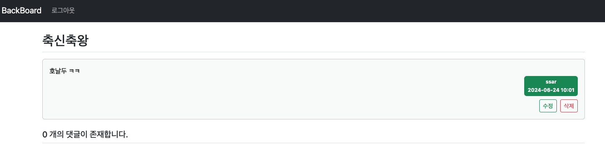
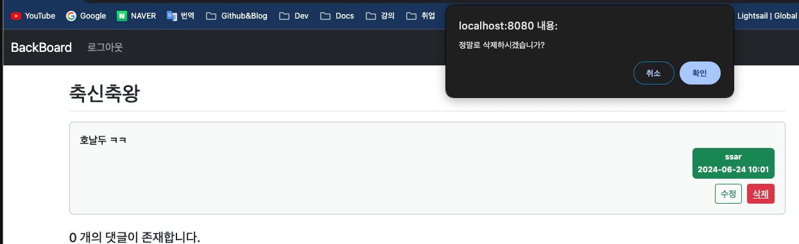

## Springboot 9일차
> 1. 수정, 삭제 기능 추가
---
## 수정, 삭제 기능 추가
### 엔티티 수정날짜 필드 추가
- 댓글이나 게시물 수정 시 수정한 날짜가 필요하기 때문에 컬럼을 추가
- `Board` , `Reply` 엔티티에 수정일자 필드 추가
    ```java
    @LastModifiedDate // 수정일자
    @Column(name = "modifyDate")
    private LocalDateTime modifyDate;
    ```
### Board 수정 로직 추가
- 우선 `Board` 엔티티부터 수정,삭제로직을 추가한다.
- `detail.html` 에 **수정 버튼**과 **삭제 버튼**을 추가한다.
  ```html
  <!-- 수정삭제 버튼 영역 -->
  <div th:if="${board.writer != null and #authentication.getPrincipal().getUsername() == board.writer.username}"
       sec:authorize="isAuthenticated()"
       class="mt-2 d-flex justify-content-end">
    <a th:href="@{|/board/modify/${board.bno}|}" class="btn btn-sm btn-outline-success mx-2">수정</a>
    <a th:data-uri="@{|/board/delete/${board.bno}|}"
       href="javascript:void(0);" class="delete btn btn-sm btn-outline-danger">삭제</a>
  </div>
  ```
  
- 삭제는 조금 방식이 다르기 때문에 `JavaScript` 코드가 필요하다
  ```javascript
  <script layout:fragment="sub-scrdipt" type="text/javascript">
      const del_elements = document.getElementsByClassName("delete");
  
      Array.from(del_elements).forEach(element => {
          element.addEventListener("click", () => {
              if (confirm("정말로 삭제하시겠습니가?")) 
                  location.href = this.dataset.uri;
          });
      });
  </script>
  ```
  
- `create.html` 에 있는 `<form>` 태그에 있는 `th:action` 을 삭제해준다.
  - `th:action` 이 없으면 `post` 방식으로 `/board/create` 로 하면 `action` 값이 `/board/create` 로 설정되고, `post` 방식으로 `/board/modify/{bno}` 로 실행하면 `action` 값이 `/board/modify/{bno}` 로 설정된다.
  - 즉, `th:action` 이 없으면 요청 URL 에 맞게 알아서 설정이 된다.
- `BoardController` 에 수정화면으로 이동시킬 컨트롤러를 생성한다.
  ```java
  @PreAuthorize(("isAuthenticated()"))
  @GetMapping("/board/modify/{bno}")
  public String modifyForm(@PathVariable("bno") Long bno, BoardForm boardForm,
                           Model model,
                           @AuthenticationPrincipal PrincipalDetails principalDetails) {
      Board board = boardService.findBoard(bno);
      if(!board.getWriter().getUsername().equals(principalDetails.getUsername()))
          throw new ResponseStatusException(HttpStatus.BAD_REQUEST);
  
      boardForm.setTitle(board.getTitle());
      boardForm.setContent(board.getContent());
      model.addAttribute("boardForm", boardForm);
  
      return "board/create";
  }
  ```
- `BoardService` 에는 수정을 담당하는 로직을 추가한다.
  ```java
  @Transactional
  public void updateBoard(Board board, String title, String content){
      board.setTitle(title);
      board.setContent(content);
      board.setModifyDate(LocalDateTime.now());
      
      // PK 있으면 UPDATE
      boardRepository.save(board);
  }
  ```
- `BoardController` 에 Post 메서드를 추가하여 위에서 작성한 `service` 코드를 호출하여 수정 로직을 실행한다.
  ```java
  @PreAuthorize(("isAuthenticated()"))
  @PostMapping("/board/modify/{bno}")
  public String modify(@PathVariable("bno") Long bno,
                       @Valid BoardForm boardForm,
                       BindingResult bindingResult,
                       @AuthenticationPrincipal PrincipalDetails principalDetails) {
      if (bindingResult.hasErrors())
          return "board/create";
  
      Board board = boardService.findBoard(bno);
  
      if (!board.getWriter().equals(principalDetails.getUsername()))
          throw new ResponseStatusException(HttpStatus.BAD_REQUEST, "수정 권한이 없습니다!");
  
      boardService.updateBoard(board, boardForm);
  
      return "redirect:board/detail/" + bno;
  }
  ```
- `Spring Security`에서 `CSRF(Cross-Site Request Forgery)` 보호 기능이 **기본적으로 활성화**되어 있기 때문에, `HTML` 폼을 제출할 때 `CSRF` 토큰이 **포함되지 않으면 서버는 요청을 거부**하게 된다.
- 아래 코드를 <form> 태그 아래에 추가해줘야 한다.
  ```html
  <input type="hidden" th:name="${_csrf.parameterName}" th:value="${_csrf.token}"/>
  ```
### Board 삭제 로직 추가
- `BoardService` 에서 먼저 삭제 로직을 추가한다.
  ```java
  @Transactional
  public void deleteBoard(Board board){
      boardRepository.delete(board);
  }
  ```
- `BoardController` 에서 Get 방식으로 삭제 로직을 실행한다.
  ```java
  @PreAuthorize(("isAuthenticated()"))
  @GetMapping("/board/delete/{bno}")
  public String delete(@PathVariable("bno") Long bno,
                       @AuthenticationPrincipal PrincipalDetails principalDetails) {
  
      Board board = boardService.findBoard(bno);
      if (!board.getWriter().getUsername().equals(principalDetails.getUsername()))
          throw new ResponseStatusException(HttpStatus.BAD_REQUEST, "삭제 권한이 없습니다!");
  
      boardService.deleteBoard(board);
  
      return "redirect:/board/list";
  }
  ```
- 그리고 `detail.html` 에서 삭제 버튼에 기능을 구현해준다.
  ```html
  <script layout:fragment="sub-script" type="text/javascript">
      const del_elements = document.getElementsByClassName("delete");
  
      Array.from(del_elements).forEach(function (element) {
          element.addEventListener("click", function () {
              if (confirm("정말로 삭제하시겠습니가?"))
                  location.href = this.dataset.uri;
          });
      });
  </script>
  ```
### Board 댓글 수정 및 삭제
- `detail.html` 에서 `Board` 수정,삭제와 비슷한 코드로 구현한다.
  ```html
  <!-- 댓글 수정삭제 버튼 영역 -->
  <div th:if="${reply.writer != null and #authentication.getPrincipal().getUsername() == reply.writer.username}"
       sec:authorize="isAuthenticated()"
       class="mt-2 d-flex justify-content-end">
    <a th:href="@{|/reply/modify/${reply.rno}|}" class="btn btn-sm btn-outline-success mx-2">수정</a>
    <a th:data-uri="@{|/reply/delete/${reply.rno}|}"
       href="javascript:void(0);" class="delete btn btn-sm btn-outline-danger">삭제</a>
  </div>
  ```
- `ReplyService` 클래스에 수정,삭제 로직을 추가한다.
- `BoardController` 에서 객체를 영속화 시키기 위해 `findReply()` 로 객체를 찾고, `updateReply()` 에서 영속화된 객체를 수정한다.
- 그리고 삭제는 `PK` 값으로 삭제만 시켜주면 끝이다 !
  ```java
  public Reply findReply(Long rno) {
      return replyRepository.findById(rno).orElseThrow(() -> {
          throw new NotFoundException("객체가 없습니다!");
      });
  }
  
  @Transactional
  public void updateReply(Reply reply, ReplyForm replyForm){
      reply.setContent(replyForm.getContent());
      reply.setModifyDate(LocalDateTime.now());
      replyRepository.save(reply);
  }
  
  @Transactional
  public void deleteReply(Long rno) {
      replyRepository.deleteById(rno);
  }
  ```
- `BoardController` 에서는 댓글 수정폼을 연결하는 컨트롤러를 만든다.
  ```java
  @PreAuthorize(("isAuthenticated()"))
  @GetMapping("/modify/{rno}")
  public String modifyForm(@PathVariable("rno") Long rno, 
                           ReplyForm replyForm, 
                           Model model,
                           @AuthenticationPrincipal PrincipalDetails principalDetails){
  
      Reply reply = replyService.findReply(rno);
      
      if(!reply.getWriter().getUsername().equals(principalDetails.getUsername()))
          throw new ResponseStatusException(HttpStatus.BAD_REQUEST, "수정권한이 없습니다!");
      
      replyForm.setContent(reply.getContent());
      model.addAttribute("replyForm", replyForm);
  
      return "/reply/modify";
  }
  ```
- 그리고 댓글 수정 로직을 처리하는 `Post` 방식의 컨트롤러를 생성한다.
  ```java
  @PreAuthorize(("isAuthenticated()"))
  @PostMapping("/modify/{rno}")
  public String modify(@Valid ReplyForm replyForm,
                       BindingResult bindingResult,
                       @PathVariable("rno") Long rno,
                       @AuthenticationPrincipal PrincipalDetails principalDetails) {
      if (bindingResult.hasErrors())
          return "/reply/modify";
  
      Reply reply = replyService.findReply(rno);
      if (!reply.getWriter().getUsername().equals(principalDetails.getUsername()))
          throw new ResponseStatusException(HttpStatus.BAD_REQUEST, "수정권한이 없습니다!");
  
      replyService.updateReply(reply, replyForm);
  
      return "redirect:/board/detail/" + reply.getBoard().getBno();
  }
  ```
- 그리고 삭제 관련된 컨트롤러를 구현한다.
  ```java
  @PreAuthorize(("isAuthenticated()"))
  @GetMapping("/delete/{rno}")
  public String delete(@PathVariable("rno") Long rno, @AuthenticationPrincipal PrincipalDetails principalDetails) {
      Reply reply = replyService.findReply(rno);
  
      if (!reply.getWriter().getUsername().equals(principalDetails.getUsername()))
          throw new ResponseStatusException(HttpStatus.BAD_REQUEST, "수정권한이 없습니다!");
  
      replyService.deleteReply(rno);
  
      return "redirect:/board/detail/" + reply.getBoard().getBno();
  }
  ```
- 댓글 수정폼인 `modify.html` 을 생성한다.
```html

```