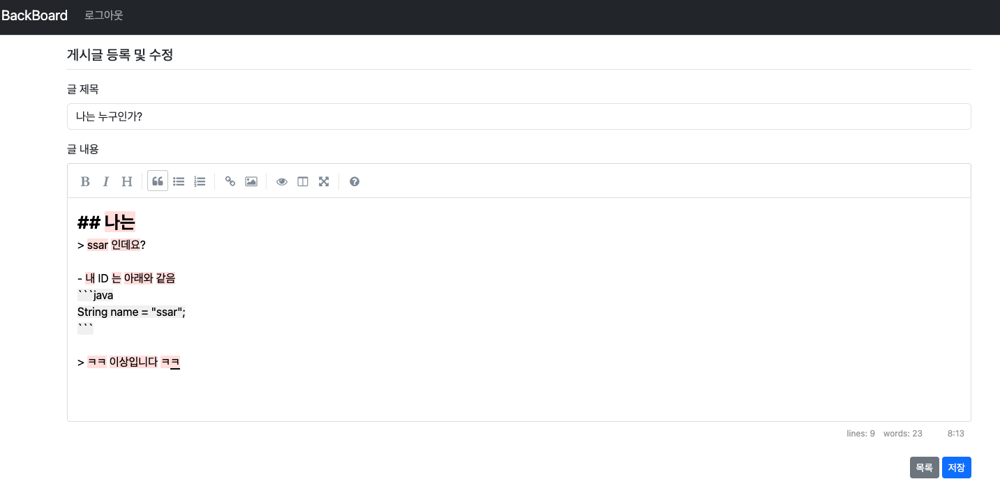
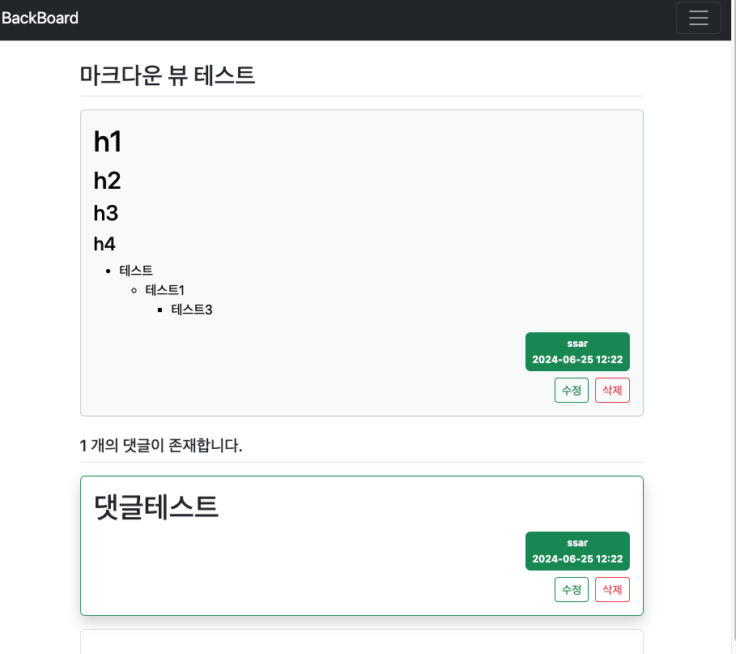
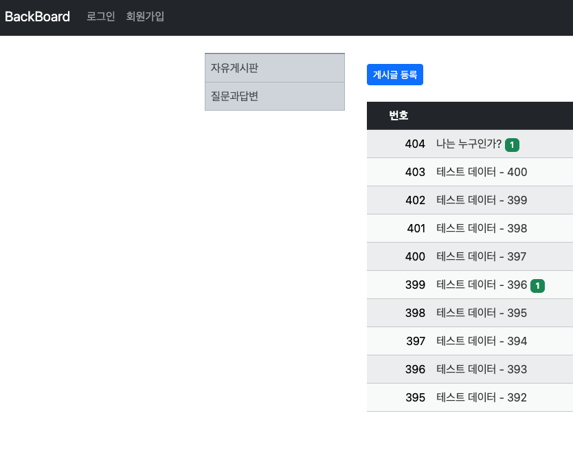
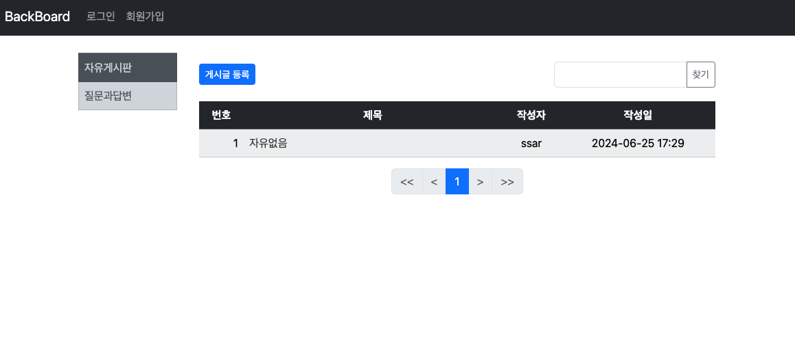
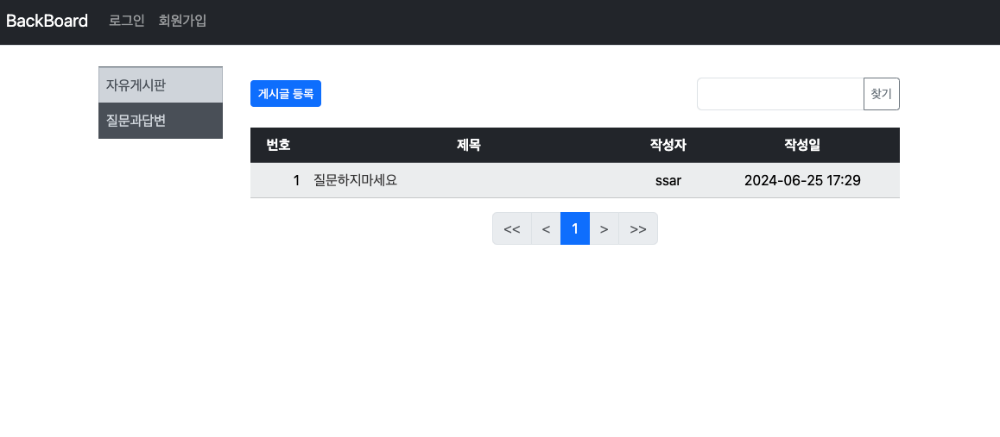

## Springboot 10일차
> 1. 검색 구현방법 변경 : JPA Query
> 2. 마크다운 에디터 구현
> 3. 카테고리 구현
---
## 1. 검색 구현방법 변경 : JPA Query
### 코드 리팩터링
- `@Query` 어노테이션으로 직접 쿼리를 작성한다.
- JPA 쿼리메서드가 아니라 JpaRepository 가 자동으로 만들어 줄 수 없을 때 어노테이션을 사용한다.
- `BoardRepository` 클래스에 `findAllByKeyword()` 메서드를 추가
  ```java
  public interface BoardRepository extends JpaRepository<Board, Long> {
      // 생략..
      @Query("SELECT DISTINCT b " +
              "FROM Board b " +
              "LEFT OUTER JOIN Reply r ON r.board = b " +
              "WHERE b.title LIKE %:kw% " +
              "OR b.content LIKE %:kw% " +
              "OR r.content LIKE %:kw% ")
      Page<Board> findAllByKeyword(@Param("kw") String kw, Pageable pageable);
  }
  ```
- `BoardService` 클래스에서 `boardList()` 메서드 수정
- 기존에는 `toPredicate` 로 쿼리를 만들었지만 지금은 `JPA` 쿼리를 사용하여 만들었다.
    ```java
    public Page<Board> boardList(int page, String keyword) {
        List<Sort.Order> sorts = new ArrayList<>();
        sorts.add(Sort.Order.desc("createDate"));
        Pageable pageable = PageRequest.of(page, 10, Sort.by(sorts));   // pageSize 동적으로 변경 가능
        
        //        Specification<Board> spec = searchBoard(keyword);
        //        return this.boardRepository.findAll(spec, pageable);
        
        return boardRepository.findAllByKeyword(keyword,pageable);
    }
    ```
---
## 2. 마크다운 에디터 구현
> 마크다운 에디터에는 여러 종류들이 있다.
> 1. [TinyMCE](https://www.tiny.cloud/)
> 2. [CKEditor](https://ckeditor.com/)
> 3. [Summernote](https://summernote.org/)

- 현재 프로젝트에서 사용할 마크다운 에디터는 [simplemde](https://simplemde.com/) 이다.
  - [깃허브](https://github.com/sparksuite/simplemde-markdown-editor)로 들어가서 CDN링크를 가져온다.
  ```html
  <link rel="stylesheet" href="https://cdn.jsdelivr.net/simplemde/latest/simplemde.min.css">
  <script src="https://cdn.jsdelivr.net/simplemde/latest/simplemde.min.js"></script>
  ```
- 에디터를 사용할 HTML 에 들어가서 JS 코드를 추가해준다. -> `detail.html` , `create.html`
  ```javascript
  var simplemde = new SimpleMDE({element: document.getElementById("MyID")});
  ```
- 아래와 같이 기존 입력폼이 마크다운 에디터로 바뀌었다.

  
- `build.gradle` 에 마크다운 의존성 추가
- `/common/CommonUtil.java` 를 생성후 `detail.html` 에 마크다운 뷰 적용
  ```java
  @Component(value = "CommonUtil")
  public class CommonUtil {
      public String markdown(String content) {
          Parser parser = Parser.builder().build();
          Node document = parser.parse(content);
          HtmlRenderer renderer = HtmlRenderer.builder().build();
          return renderer.render(document);
      }
  }
  ```
- `detail.html` 에서 기존 `th:text` 를 이용해 `content` 를 출력하는 부분을 수정한다.
  ```html
  <div th:utext="${@CommonUtil.markdown(board.getContent())}" class="card-text"></div>
  ```
  
---
## 3. 카테고리 구현
- `Category` 엔티티를 아래와 같이 구현한다.
  ```java
  @Getter
  @Setter
  @NoArgsConstructor @AllArgsConstructor
  @Entity
  public class Category {
  
      @Id
      @GeneratedValue(strategy = GenerationType.SEQUENCE)
      private Integer id;
  
      @Column(length = 30)
      private String title;
  
      @CreatedDate
      @Column(name="createDate", updatable = false)
      private LocalDateTime createDate;
  }
  ```
- 그리고 `Board` 엔티티에 `Category` 엔티티를 추가하여 연관관계를 구현한다.
  ```java
  @Getter
  @Setter
  @Builder // 객체 생성 간략화
  @NoArgsConstructor // JPA 엔티티는 기본생성자 필요
  @AllArgsConstructor // 생성자(모든필드)
  @Entity // Table
  public class Board {
      // 생략 ..
      
      @ManyToOne(fetch = FetchType.LAZY)
      private Category category;
      
      // 생략 ..
  }
  ```
- `CategoryRepository` 인터페이스를 구현한다.
  ```java
  public interface CategoryRepository extends JpaRepository<Category, Integer> {
    Optional<Category> findByTitle(String title);
  }
  ```
- `CategoryService` 에서 실제 로직을 구현한다.
  ```java
  @Transactional(readOnly = true)
  @RequiredArgsConstructor
  @Slf4j
  @Service
  public class CategoryService {
  private final CategoryRepository categoryRepository;
  
      @Transactional
      public Category saveCategory(String title) {
          return categoryRepository.save(Category.builder().title(title).createDate(LocalDateTime.now()).build());
      }
  
      public Category findCategory(String title) {
          Optional<Category> cate = this.categoryRepository.findByTitle(title);
  
          if (cate.isEmpty()) { //free나 qna 타이틀의 카테고리 데이터가 없으며
              cate = Optional.ofNullable(saveCategory(title)); // 테이블에 해당 카테고리를 생성
          }
  
          if (cate.isPresent())
              return cate.get(); //Category 리턴
          else
              throw new NotFoundException("Category not Found!"); //발생할 일이 없음
      }
  }
  ```
- `BoardService` 는 아래와 같이 구현한다.
  ```java
  public Page<Board> boardList(int page, String keyword, Category category) {
    List<Sort.Order> sorts = new ArrayList<>();
    sorts.add(Sort.Order.desc("createDate"));
    Pageable pageable = PageRequest.of(page, 10, Sort.by(sorts));   // pageSize 동적으로 변경 가능
  
    Specification<Board> spec = searchBoard(keyword, category.getId());
    return boardRepository.findAll(spec, pageable);
  }
  
  // 카테고리 추가 관련 메서드
  public Specification<Board> searchBoard(String keyword, Integer cateId) {
      return new Specification<Board>() {
          private static final long serialVersionUID = 1L;    // 필요한 값이라서 추가
  
          @Override
          public Predicate toPredicate(Root<Board> b, CriteriaQuery<?> query, CriteriaBuilder cb) {
              // query를 JPA로 생성
              query.distinct(true);   // 중복제거
              Join<Board, Reply> r = b.join("replies", JoinType.LEFT);
  
              return cb.and(cb.equal(b.get("category").get("id"), cateId),
                      cb.or(cb.like(b.get("title"), "%" + keyword + "%"),  // 게시글 제목에서 검색
                              cb.like(b.get("content"), "%" + keyword + "%"), // 게시글 내용에서 검색
                              cb.like(r.get("content"), "%" + keyword + "%")
                      ));
          }
      };
  }
  ```
- `layout.html` 에서 사이드바를 추가한다.
  ```html
  <!-- 레이아웃에 적용될 하위페이지 위치 -->
  <div class="container mt-3" style="height: auto !important;">
    <div class="row">
      <div class="col-sm-12 col-md-3 col-lg-2 p-2">
        <!-- 게시판 카테고리 영역 -->
        <nav class="border-top border-secondary">
          <div class="list-group">
            <a th:classappend="|${category} == 'free' ? 'active'|" th:href="@{/board/list/free}"
               class="category-group rounded-0 list-group-item list-group-item-action list-group-item-dark p-2">
              자유게시판
            </a>
            <a th:classappend="|${category} == 'qna' ? 'active'|" th:href="@{/board/list/qna}"
               class="category-group rounded-0 list-group-item list-group-item-action list-group-item-dark p-2">
              질문과답변
            </a>
          </div>
        </nav>
      </div>
      <div class="col-sm-12 col-md-9 col-lg-10">
        <!--  기존 게시판 영역  -->
        <th:block layout:fragment="main-content"></th:block>
      </div>
    </div>
  </div>
  ```
  
- `BoardService` 에서 `saveBoard()` 메서드를 오버로딩한다.
  ```java
  @Transactional
  public void saveBoard(String title, String content, Member writer, Category findCategory) {
      boardRepository.save(Board.builder().title(title).content(content).writer(writer).category(findCategory).createDate(LocalDateTime.now()).build());
  }
  ```
- `BoardController` 에 카테고리 관련 컨트롤러 추가(`CategoryService` 의존성 추가 해준다.)
  ```java
  @GetMapping("/board/list/{category}")
  public String list(Model model,
                   @PathVariable("category") String category,
                   @RequestParam(value = "page", defaultValue = "0") int page,
                   @RequestParam(value = "kw", defaultValue = "") String keyword) {
  Category findCategory = categoryService.findCategory(category);
  
  Page<Board> paging = this.boardService.boardList(page, keyword, findCategory); // 검색 및 카테고리 추가
  model.addAttribute("paging", paging);
  model.addAttribute("kw", keyword);
  model.addAttribute("category", category);
  
  return "/board/list";
  }
  
  // 카테고리 추가
  @PreAuthorize(("isAuthenticated()"))
  @GetMapping("/board/create/{category}")
  public String createForm(@PathVariable("category") String category,
                           BoardForm boardForm,
                           Model model) {
      model.addAttribute("boardForm", boardForm);
      model.addAttribute("category", category);
      return "/board/create";
  }
  
  // 카테고리 추가
  @PreAuthorize(("isAuthenticated()"))
  @PostMapping("/board/create/{category}")
  public String create(@PathVariable("category") String category,
                       @Valid BoardForm form,
                       BindingResult bindingResult,
                       @AuthenticationPrincipal PrincipalDetails principalDetails,
                       Model model) {
      if (bindingResult.hasErrors()) {
          model.addAttribute("category", category);
          return "redirect:/board/create";
      }
      Category findCategory = categoryService.findCategory(category);
      boardService.saveBoard(form.getTitle(), form.getContent(), principalDetails.getMember(), findCategory);
  
      return "redirect:/board/list/" + category;
  }
  ```
  
  
  
---
