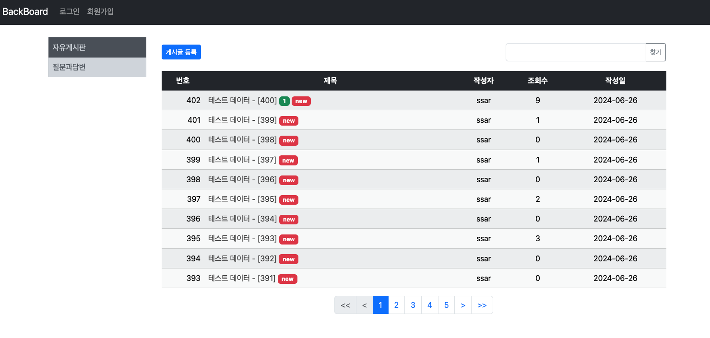
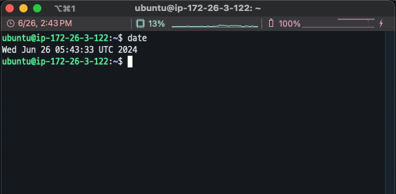
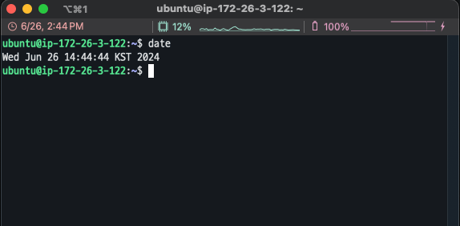
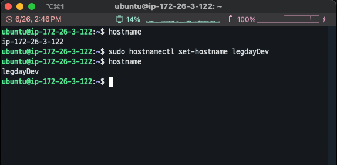
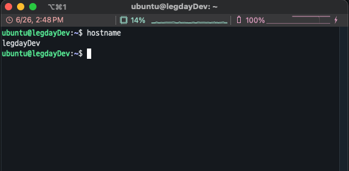
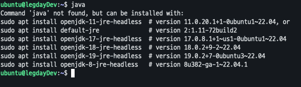
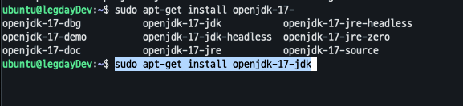
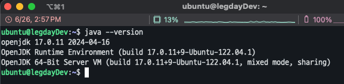
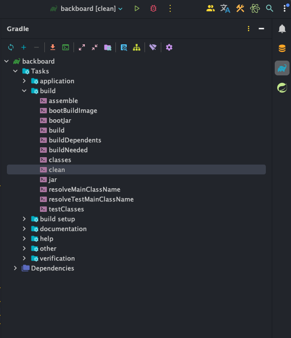

## Springboot 11일차
> 1. 조회수 표시
> 2. AWS Lightsail 사용
---
## 1. 조회수 표시
- `Board` 엔티티에 조회수 컬럼을 추가한다.
    ```java
    @Getter
    @Setter
    @Builder // 객체 생성 간략화
    @NoArgsConstructor // JPA 엔티티는 기본생성자 필요
    @AllArgsConstructor // 생성자(모든필드)
    @Entity // Table
    public class Board {
        // 생략 ..
        @ColumnDefault(value = "0")
        private Integer hit; // 조회수 컬럼
        // 생략 ..
    }
    ```
- `BoardService` 에서 조회수 로직을 추가한다. -> `hitBoard()`
  ```java
  @Transactional
  public Board hitBoard(Long bno) {
      Board boardPS = boardRepository.findById(bno).orElseThrow(() -> {
          throw new NotFoundException("Board Not Found");
      });
      if (boardPS.getHit() == null) {
          boardPS.setHit(0);
          boardPS.setHit(boardPS.getHit() + 1);
      } else {
          boardPS.setHit(boardPS.getHit() + 1);
      }
      return boardPS;
  }
  ```
- `BoardController` 에서는 기존의 `findBoard()` 를 호출하는게 아닌, 조회수를 증가시키고 엔티티를 반환하는 `hitBoard()` 를 호출한다.
  ```java
  @GetMapping("/board/detail/{bno}")
  public String detailForm(@PathVariable("bno") Long bno, Model model, ReplyForm replyForm) {
      model.addAttribute("replyForm", replyForm);
      model.addAttribute("board", boardService.hitBoard(bno));
      return "/board/detail";
  }
  ```
- `list.html` 에서 작성자 이름 뒤에 조회수를 랜더링한다. 추가로 게시물 생성날짜가 오늘인 경우 new 뱃지를 띄어준다.
  ```html
  <!--  조회수 추가  -->
  <td>
    <span th:text="${board.getHit()}"></span>
  </td>
  
  <!-- 새 게시글 뱃지 -->
  <span th:if="${#temporals.format(board.getCreateDate(), 'yyyy-MM-dd') == #temporals.format(#temporals.createNow(), 'yyyy-MM-dd')}"
      class="badge badge-sm text-bg-danger">new</span>
  ```
  
---
## 2. AWS Lightsail 사용
### DB 변경
- AWS 업로드 전에 DB 를 H2 로 변경해줘야 한다 !
  > `AWS Lightsail` 에서는 `Oracle DB`를 지원하지 않는다 !
- `application.properties` 에서 H2 DB 설정들을 추가하고 이전의 Oracle DB 설정들을 주석처리해준다. 그리고 JPA 설정도 수정해준다.
  ```properties
  # H2
  spring.h2.console.enabled=true
  spring.datasource.url=jdbc:h2:tcp://localhost/~/local
  spring.datasource.driver-class-name=org.h2.Driver
  spring.datasource.username=sa
  spring.datasource.password=
  
  # JPA
  #spring.jpa.properties.hibernate.dialect=org.hibernate.dialect.OracleDialect
  spring.jpa.database=h2
  spring.jpa.properties.hibernate.dialect=org.hibernate.dialect.H2Dialect
  
  # Oracle
  #spring.datasource.driver-class-name=oracle.jdbc.driver.OracleDriver
  #spring.datasource.url=jdbc:oracle:thin:@localhost:1521:XE
  #spring.datasource.username=username
  #spring.datasource.password=password
  ```
### SSH 원격 접속
> AWS Lightsail 에서 인스턴스 생성 시 Ubuntu 로 생성하고 고정IP주소를 할당받아서 세팅해놓는다.
- `Windows` 라면 `Putty` 를 사용하지만 `Mac` 에서는 터미널을 통해 원격 SSH 접속을 한다.
- 우선 `AWS Lightsail` 에서 SSH 키를 저장후 `~/.ssh` 경로에 넣어준다.
- 터미널을 열고 아래 명령어를 입력
  ```shell
  ssh -i [SSH 저장 경로] ubuntu@[고정IP주소] -o StrictHostKeyChecking=no
  ```
### Ubuntu 설정 변경
- `date` 명령어 입력 후 날짜 확인
  
  
- 한국날짜로 변경
  ```shell
  sudo ln -sf /usr/share/zoneinfo/Asia/Seoul /etc/localtime
  ```
  
- `hostname` 변경 -> 
  ```shell
  sudo hostnamectl set-hostname legdayDev
  ```
  
- `sudo reboot` 입력후 서버재시작을 하면 `hostname` 이 변경이 되어있다.

  
- 전체서버 패키지 업데이트를 한다.
  ```shell
  sudo apt-get update
  ```
- `Java` 설치
- java 명령어 입력 후 설치목록을 확인한다(_**절대 아래 목록에서 설치하면 안된다!**_)

  
- `sudo apt-get install openjdk` 까지 치고 tab 키를 누르면 관련 목록들이 나온다.
- 아래 명령어로 입력하여 설치!(jdk 버전은 스프링프로젝트 버전에 맞게설치, 중간에 Y를 누르면됨)
  ```shell
  sudo apt-get install openjdk-17-jdk
  ```
  
- 설치가 완료되면 `java --version` 입력 후 Java 버전을 확인한다.

  

### 스프링 프로젝트 jar 굽기
- `IntelliJ` 기준 우측에 Gradle 벝느 클릭 후 `Tasks`->`build`->`clean` 을 실행한다!

  
- 위에서 문제없이 완료되면 `Tasks` -> `build` -> `build` 실행
