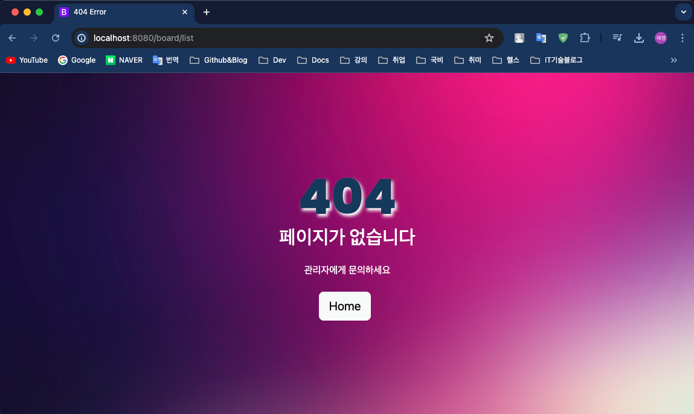
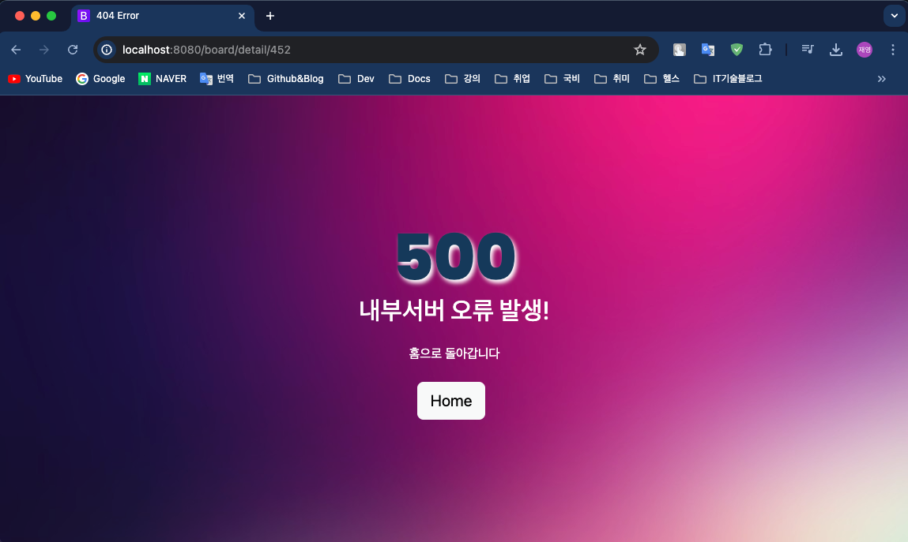
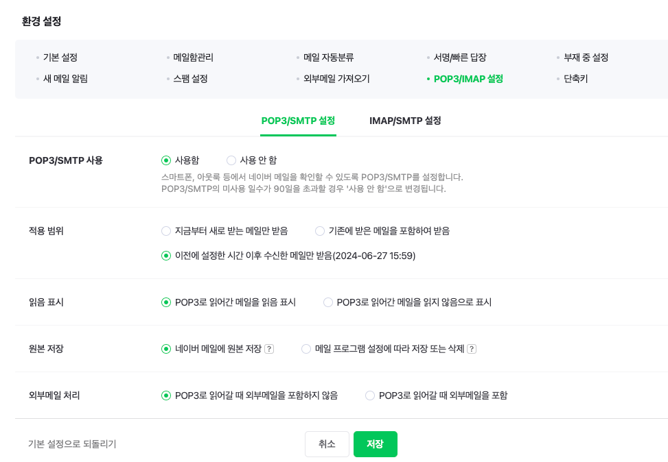
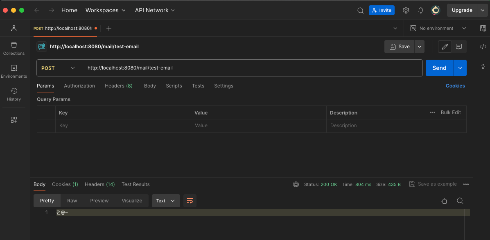
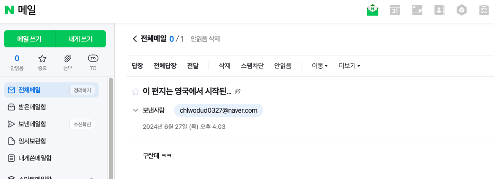

## Springboot 12일차
> 1. 에러페이지 세팅
> 2. 이메일 전송(네이버)
---
## 1. 에러페이지 세팅
> `Springboot` 에서 `HttpStatus` 가 4xx, 5xx 등으로 일어날 때 **기본적으로 제공하는 페이지**가 있다.<br>

### 백그라운드 이미지 추가
- `/resources/static/images/` 경로에 `bg_error.jpg` 이미지 추가

### 에러페이지 구현
- 에러페이지는 `/templates/error/` 경로 안에 `404.html` , `500.html` , `error.html` , `custom.css` 을 생성한다.

### 스프링부트 에러페이지 자동 생성
- 스프링부트는 자체적으로 `BasicErrorController` 클래스에 의해서 에러페이지를 지원한다.
- `resources/templates/error` 경로안에 에러페이지를 만들면 `BasicErrorController` 클래스가 해당 경로로 들어가 `HttpStatus` 에 맞는 페이지를 찾아간다.
  - 4xx 번 대 에러페이지는 `4xx.html` 로 만들면된다.
  - 구체적인 상태코드를 지정할려면 `404.html` 을 만들면 된다.

> 즉, `application.properties` 에서 설정을 안해도 `HttpStatus` 코드에 맞는 html 을 `/templates/error/` 경로 안에 생성하면 알아서 찾아준다.

### 404 에러

### 500 에러

---
## 2. 이메일 전송(네이버)
### build.gradle 추가
- `mail` 의존성을 추가한다.
  ```groovy
  // 메일 디펜던시
  implementation 'org.springframework.boot:spring-boot-starter-mail'
  implementation 'org.springframework:spring-context-support'
  ```
### applicatoin.properties 변경
- 테스트용 구글 계정을 만들어서 `username` 과 `password` 를 만들어준다.
  ```properties
  # 메일설정
  spring.mail.host=smtp.naver.com
  spring.mail.port=465
  spring.mail.username={username}
  spring.mail.password={password}
  spring.mail.properties.mail.smtp.starttls.enable=true
  spring.mail.properties.mail.smtp.auth=true
  spring.mail.properties.mail.smtp.ssl.enable=true
  spring.mail.properties.mail.smtp.ssl.trust=smtp.naver.com
  spring.mail.properties.mail.debug=true
  ```
### 네이버 계정 설정 변경


### CSRF 설정 변경
- 서비스단계가 아닌 개발단계이기 때문에 `CSRF` 설정을 `disable()` 설정을 한다.
  ```java
  @Bean
  public SecurityFilterChain securityFilterChain(HttpSecurity http) throws Exception {
    // 생략 ..
      http.csrf(csrf->csrf.disable());
      // 생략 ..
      return http.build();
  }
  ```

### MailService 생성
- `JavaMailSender` 를 주입받아 메일을 전송하는 `sendMail()` 메서드를 구현한다.
  ```java
  @Transactional(readOnly = true)
  @RequiredArgsConstructor
  @Service
  public class MailService {
  
      private final JavaMailSender javaMailSender;
  
      @Value("${spring.mail.username}")
      private String from;
  
      public void sendMail(String to, String subject, String message) {
          MimeMessage mimeMessage = javaMailSender.createMimeMessage(); // MIME type 설정
  
          try {
              // MimeMessageHelper 로 MimeMessage 구성
              MimeMessageHelper mmh = new MimeMessageHelper(mimeMessage, false, "UTF-8");
  
              // 이메일 수신자 설정
              mmh.setTo(to);
              // 이메일 제목 설정
              mmh.setSubject(subject);
              // 이메일 본문 내용 설정
              mmh.setText(message);
              // 이메일 발신자 설정
              mmh.setFrom(new InternetAddress(from));
              // 이메일 전송
              javaMailSender.send(mimeMessage);
  
          }catch (MessagingException e) {
              throw new RuntimeException(e);
          }
      }
  }
  ```
### RestController 생성
- API 통신이기 때문에 `ResponseEntity` 타입을 반환하여 HTTP 바디에 메시지를 담는다 !
  ```java
  @RequiredArgsConstructor
  @RequestMapping("/mail")
  @RestController
  public class MailController {
      private final MailService mailService;
  
      @PostMapping("/test-email")
      public ResponseEntity<String> testEmail() {
          String to = "chlwodud0327@naver.com";
          String subject = "이 편지는 영국에서 시작된..";
          String message = "구란데 ㅋㅋ";
  
          mailService.sendMail(to, subject, message);
          return ResponseEntity.ok().body("전송~");
      }
  }
  ```

### Postman 테스트
- `Postman` 으로 `HTTP Method` 와 `URL` 을 지정하고 전송을 누르면 아래와 같이 성공 응답이 온다

  
  
