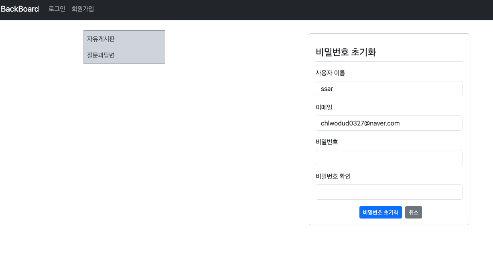

## Springboot 13일차
> 1. 비밀번호 초기화 구현
---
## 1. 비밀번호 초기화 구현
> 현재 CSRF 비활성화 설정 때문에 CSRF 토큰코드가 있는 html 파일을 수정한다 -> `reate.html` , `modify.html`
### 비밀번호 초기화 버튼 추가
-  `login.html` 파일에 비밀번호 초기화 버튼을 추가하여 `reset.html` 화면을 연결한다.
    ```html
    <!--  비밀번호 초기화 버튼  -->
    <a href="/member/reset" class="btn btn-sm btn-info">비밀번호 초기화</a>
    ```
- `MemberController` 에는 비밀번호 초기화 화면을 연결한 컨트롤러를 추가한다.
    ```java
    @GetMapping("/reset")
    public String resetForm() {
        return "member/reset";
    }
    ```
- `reset.html` 을 구현하여 비밀번호 초기화 화면을 만든다.
    ```html
    <!doctype html>
    <html lang="ko" xmlns:th="http://www.thymeleaf.org" layout:decorate="~{layout}">
    
    <div layout:fragment="main-content" class="card container my-3 form-register">
      <div class="my-3 border-bottom">
        <h4>비밀번호 초기화</h4>
      </div>
    
      <form th:action="@{/mail/reset-mail}" method="post">
    <!--    <div th:replace="~{error :: formErrorFragment}"></div>-->
    
        <div class="mb-3">
          <label for="email" class="form-label">이메일</label>
          <input type="email" id="email" name="email" class="form-control" required>
        </div>
    
        <div class="d-flex justify-content-center">
          <button type="submit" class="btn btn-sm btn-primary mx-2">초기화</button>
          <a href="/" class="btn btn-sm btn-secondary">취소</a>
        </div>
      </form>
    </div>
    </html>
    ```
- `MainController` 클래스를 생성 후 `/mail/reset-mail` URL의 POST 매핑 메서드를 생성한다.
- 그리고 **이메일을 DB에서 조회후 유효한 이메일인지 체크**하기 위해 `email` 을 통해 `Member` 를 찾는 메서드를 `MemberService` 코드에 추가해준다.
    ```java
    public Optional<Member> findByEmail(String email) {
        return memberRepository.findByEmail(email);
    }
    ```
- `MailController` 에 Post매핑으로 이메일을 보내는 코드를 작성한다.
    ```java
    @PostMapping("/register")
    public String register(@Valid MemberForm memberForm, BindingResult bindingResult) {
        if (bindingResult.hasErrors()) {
            return "member/register";
        }
    
        if (!memberForm.getPassword().equals(memberForm.getRePassword())) {
            bindingResult.rejectValue("rePassword", "passwordInCorrect", "패스워드가 일치하지 않습니다!");
            return "member/register";
        }
    
        try {
            memberService.saveMember(memberForm.getUsername(), memberForm.getEmail(), memberForm.getPassword());
        } catch (DataIntegrityViolationException e) { // 데이터 무결성 예외
            e.printStackTrace();
            bindingResult.reject("registerFailed", "이미 등록된 사용자입니다.");
            return "member/register";
        } catch (Exception e) {
            e.printStackTrace();
            bindingResult.reject("registerFailed", e.getMessage());
            return "member/register";
        }
        return "redirect:/";
    }
    ```
- `MailServier` 에 실제 이메일을 전송하는 코드를 추가한다.
  ```java
  @Transactional(readOnly = true)
  @RequiredArgsConstructor
  @Service
  public class MailService {
  
      private final JavaMailSender javaMailSender;
  
      // 메일에서 초기화할 화면으로 이동 URL
      private String resetPassUrl = "http://localhost:8080/member/reset-password";
  
      @Value("${spring.mail.username}")
      private String from;
      
      public boolean sendResetPasswordEmail(String email) {
          String subject = "요청하신 비밀번호 재설정입니다";
          String message = "BackBoard"
                  + "<br><br>" + "아래의 링크를 클릭하면 비밀번호 재설정 페이지로 이동합니다." + "<br>"
                  + "<a href='" + resetPassUrl + "/" + email + "'>"
                  + resetPassUrl + "/" + "</a>" + "<br><br>";
  
          try {
              sendMail(email, subject, message);
              return true;
          } catch (Exception e) {
              return false;
          }
      }
  }
  ```
  

- 현재 로직에 문제는 **사용자 이메일이 URL 에 노출**이된다 ! 그래서 `UUID` 를 만들어서 `message` 에 담아야한다. 아래처럼 `MailService` 를 수정
  ```java
  @Transactional(readOnly = true)
  @RequiredArgsConstructor
  @Service
  public class MailService {
      
      // 생략 ..
    // 랜덤 문자열을 반환하는 메서드 생성
    private String makeUuid() {
      return UUID.randomUUID().toString();
    }
    
    public boolean sendResetPasswordEmail(String email) {
      String uuid = makeUuid();
  
      String subject = "요청하신 비밀번호 재설정입니다";
      String message = "BackBoard"
              + "<br><br>" + "아래의 링크를 클릭하면 비밀번호 재설정 페이지로 이동합니다." + "<br>"
              + "<a href='" + resetPassUrl + "/" + email + "'>"
              + resetPassUrl + "/" + uuid + "</a>" + "<br><br>";
  
      try {
        sendMail(email, subject, message);
        return true;
      } catch (Exception e) {
        return false;
      }
    }
    
    // 생략 ..
  }
  ```
  
- `Reset` 엔티티와 `ResetRepository` 인터페이스를 생성한다.
  ```java
  @Data
  @Builder
  @NoArgsConstructor
  @AllArgsConstructor
  @Entity
  public class Reset {
  
      @Id
      @GeneratedValue(strategy = GenerationType.SEQUENCE)
      private Integer id;
  
      private String email;
  
      private String uuid;
  
      @CreatedDate
      @Column(updatable = false)
      private LocalDateTime regDate;
  }
  // ---------------------------------
  public interface ResetRepository extends JpaRepository<Reset, Integer> {
      Optional<Reset> findByUuid(String uuid);
  }
  ```
  
- `ResetService` 에는 동작할 비즈니스 로직을 추가한다.
  ```java
  @Transactional(readOnly = true)
  @RequiredArgsConstructor
  @Slf4j
  @Service
  public class ResetService {
  
      private final ResetRepository resetRepository;
  
      @Transactional
      public void saveReset(String uuid, String email) {
          resetRepository.save(
                  Reset.builder().
                          uuid(uuid).
                          email(email).
                          regDate(LocalDateTime.now()).
                          build());
          log.info("ResetService = saveReset() 메서드 성공");
      }
  
      public Reset findResetByUuid(String uuid) {
          return resetRepository.findByUuid(uuid).orElseThrow(() -> {
              log.warn("ResetService = findResetByUuid() 메서드 실패 !");
              throw new NotFoundException("찾는 객체가 없습니다!");
          });
      }
  }
  ```
- `MailService` 에서 `ResetService` 를 불러와서 사용한다(스프링 MVC 구조에는 맞지않은 방법이다 !)
- 한 메서드에서 다른 서비스를 불러와서 DB에 저장하기 떄문에 클래스단에 지정한 `@Transactional` 을 지우고 메서드단에 `java`에서 제공하는 `@Transacional` 을 사용
  ```java
  @RequiredArgsConstructor
  @Service
  public class MailService {
  
      private final JavaMailSender javaMailSender;
      private final ResetService resetService;
        
    // 생략...
      @Transactional
      public boolean sendResetPasswordEmail(String email) {
          String uuid = makeUuid();
  
          String subject = "요청하신 비밀번호 재설정입니다";
          String message = "BackBoard"
                  + "<br><br>" + "아래의 링크를 클릭하면 비밀번호 재설정 페이지로 이동합니다." + "<br>"
                  + "<a href='" + resetPassUrl + "/" + uuid + "'>"
                  + resetPassUrl + "/" + uuid + "</a>" + "<br><br>";
  
          try {
              sendMail(email, subject, message);
              saveUuidAndEmail(uuid, email);
              return true;
          } catch (Exception e) {
              return false;
          }
      }
  
      private void saveUuidAndEmail(String uuid, String email) {
          resetService.saveReset(uuid, email);
      }
  }
  ```
- 사용자가 메일을 받고 링크를 클릭했을 때 연결한 화면 컨트롤러와 실제 비밀번호변경을 구현하는 코드를  `MemberController` 에 구현한다.
  ```java
  @RequiredArgsConstructor
  @RequestMapping("/member")
  @Slf4j
  @Controller
  public class MemberController {
      private final MemberService memberService;
      private final ResetService resetService;
      
      // 생략 ...
  
      @GetMapping("/reset-password/{uuid}")
      public String resetPasswordForm(@PathVariable("uuid") String uuid, Model model) {
          Reset resetPS = resetService.findResetByUuid(uuid);
          log.info("MemberController = 확인된 이메일({})", resetPS.getEmail());
          return null;
      }
  
      @PostMapping("/reset-password")
      public String resetPassword(@Valid @ModelAttribute MemberForm memberForm, BindingResult bindingResult) {
          if (bindingResult.hasErrors()) {
              return "member/newpassword";
          }
    
          if (!memberForm.getPassword().equals(memberForm.getRePassword())) {
              bindingResult.rejectValue("rePassword", "passwordInCorrect", "패스워드가 일치하지 않습니다!");
              return "member/register";
          }
          Member memberPS = memberService.findMember(memberForm.getUsername());
          memberPS.setPassword(memberForm.getPassword());
    
          memberService.saveMember(memberPS);
    
          return "redirect:/member/login";
      }
  }
  ```
- `newpassword.html` 화면은 아래와 같다.
  ```html
  <!doctype html>
  <html lang="ko" xmlns:th="http://www.thymeleaf.org" layout:decorate="~{layout}">
  
  <div layout:fragment="main-content" class="card container my-3 form-register">
    <div class="my-3 border-bottom">
      <h4>비밀번호 초기화</h4>
    </div>
  
    <form th:action="@{/member/reset-password}" th:object="${memberForm}" method="post">
      <!-- errors.html 추가 -->
      <div th:replace="~{errors :: formErrorFragment}"></div>
      <div class="mb-3">
        <label for="username" class="form-label">사용자 이름</label>
        <input type="text" id="username" th:field="*{username}" class="form-control bg-light" readonly>
      </div>
  
      <div class="mb-3">
        <label for="email" class="form-label">이메일</label>
        <input type="email" id="email" th:field="*{email}" class="form-control bg-light" readonly>
      </div>
  
      <div class="mb-3">
        <label for="password" class="form-label">비밀번호</label>
        <input type="password" id="password" th:field="*{password}" class="form-control">
      </div>
  
      <div class="mb-3">
        <label for="repassword" class="form-label">비밀번호 확인</label>
        <input type="password" id="repassword" th:field="*{rePassword}" class="form-control">
      </div>
  
      <div class="d-flex justify-content-center">
        <button type="submit" class="btn btn-sm btn-primary mx-2">비밀번호 초기화</button>
        <a href="/" class="btn btn-sm btn-secondary">취소</a>
      </div>
    </form>
  </div>
  </html>
  ```
  
---