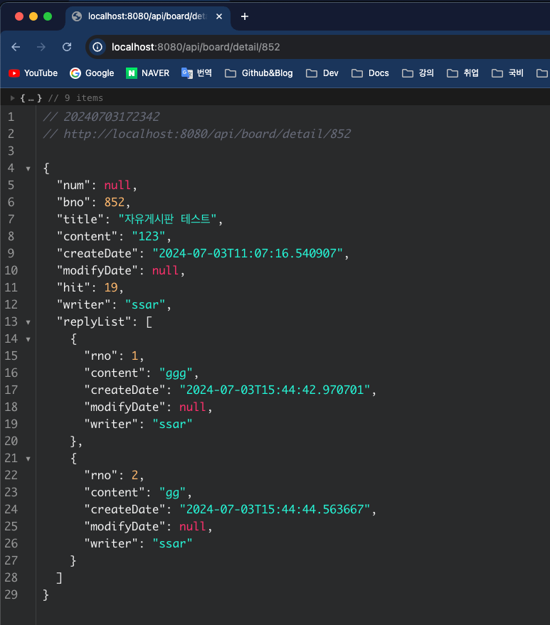
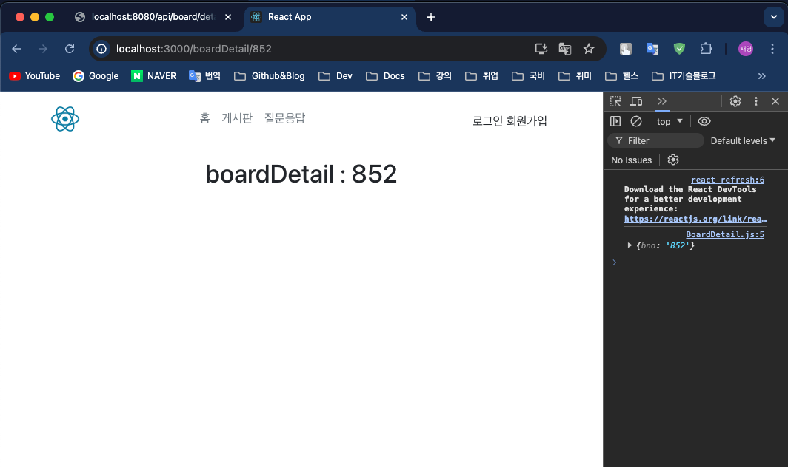

## Springboot + React 14일차
> 1. React 세팅 및 연동 
> 2. 상세화면
---
## 1. React 세팅 및 연동
### 리액트 개요
> 리액트를 연동하기 전 `Thymeleaf` 를 통해 `View` 를 랜더링하는 방식은 `SSR(Server Side Rendering)`이다.<br>

- 리액트를 연동하면 View 랜더링은 `CSR(Client Side Rendering)` 방식으로 바뀐다.<br>
- `SpringBoot` 는 `React` 로 데이터만 넘겨주는 **API 통신**만 하게 된다.
- React 는 Meta(Facebook)에서 웹페이지를 좀 더 개선해보고자 개발을 시작하면서 만들어진 프레임워크이다.
- React 는 기본적으로 SPA(Single Page Application)을 목적으로 만들었다.
- node.js 는 JS를 사용해서 서버를 동작한다.
---
### 리액트 세팅
1. [node.js](https://nodejs.org/en)설치
2. 리액트 패키지 설치
   - `npm uninstall -g create-react-app`
   - `npm install -g create-react-app`
3. 작업환경에서 명령어 입력
   - `npx create-react-app 파일명`
4. 리액트 패키징
   - 리액트용 `Bootstrap` 설치 : `npm install react-bootstrap bootstrap`
   - REST API 통신 라이브러리 : `npm install axios`
   - 리액트 화면 네비게이션 : `npm install react-router-dom`
   - 리액트 페이징 처리 : `npm install react-js-pagination`
>  `npm audix fix --force` 는 절대 하지 말것!!!
---
## 2. 상세화면
### Backend 작업
- `RestBoardController` 클래스에 상세화면 컨트롤러 추가
  ```java
  @GetMapping("/detail/{bno}")
  public BoardDto detailForm(@PathVariable("bno") Long bno, HttpServletRequest request) {
    String prevUrl = request.getHeader("referer");
    Board boardPS = boardService.hitBoard(bno);
    BoardDto board = BoardDto.builder()
            .bno(boardPS.getBno())
            .title(boardPS.getTitle())
            .content(boardPS.getContent())
            .createDate(boardPS.getCreateDate())
            .modifyDate(boardPS.getModifyDate())
            .writer(boardPS.getWriter().getUsername())
            .build();
  
    System.out.println("========");
    System.out.println(board.getReplyList());
    System.out.println("========");
    List<ReplyDto> replyList = new ArrayList<>();
    if (boardPS.getReplies() != null) {
      boardPS.getReplies().forEach(
              reply -> replyList.add(ReplyDto.builder().
                      content(reply.getContent()).
                      createDate(reply.getCreateDate()).
                      modifyDate(reply.getModifyDate()).
                      rno(reply.getRno()).
                      writer(reply.getWriter().getUsername()).
                      build())
      );
    }
    board.setReplyList(replyList);
    return board;
  }
  ```
  
### Frontend 작업
- `App.js` 에서 코드를 추가한다.
  ```javascript
  import './App.css';
  
  import 'bootstrap/dist/css/bootstrap.min.css';
  
  // 화면 라우팅을 위해서 라이브러리 추가
  import {Routes, Route} from 'react-router-dom'
  import React from 'react';
  
  // 만든 화면 추가
  // 생략...
  import BoardDetail from "./routes/BoardDetail";
  
  function App() {
      return (
          <Routes>
              {/* a, Link 링크를 누르면 화면전환될 페이지 */}
              // 생략 ...
              <Route path='/boardDetail/:bno' element={<BoardDetail/>}/>
          </Routes>
      );
  }
  
  export default App;
  ```
- `src/routes` 경로에 `BoardDetails.js` 파일을 생성한다.
  ```javascript
  import {useParams} from "react-router-dom";
  
  function BoardDetail() {
      const params = useParams();
      console.log(params);
      return (
          <div className="container main">
              <h1>boardDetail : {params.bno}</h1>
          </div>
      );
  }
  
  export default BoardDetail;
  ```
  
---